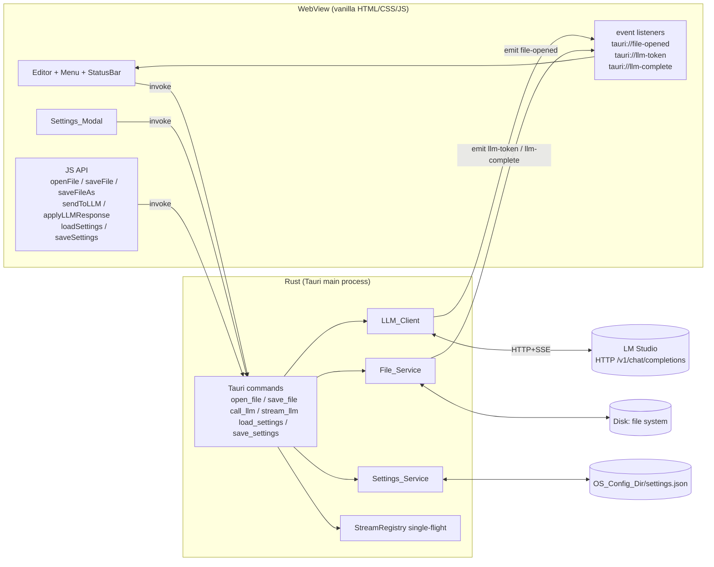
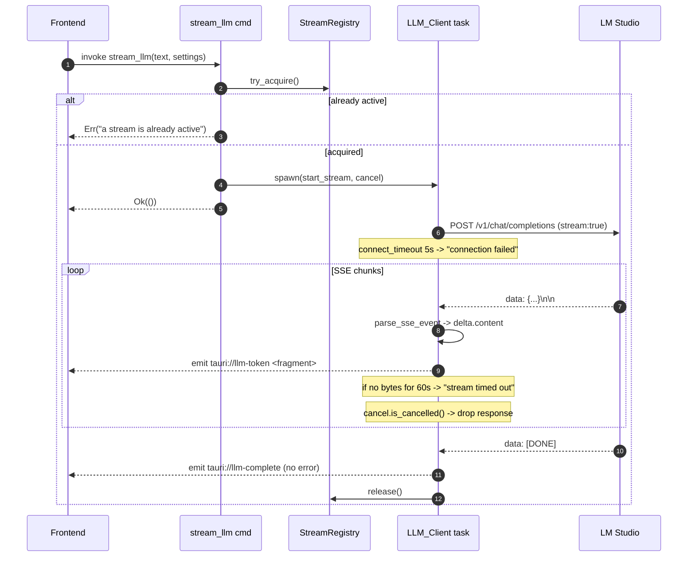
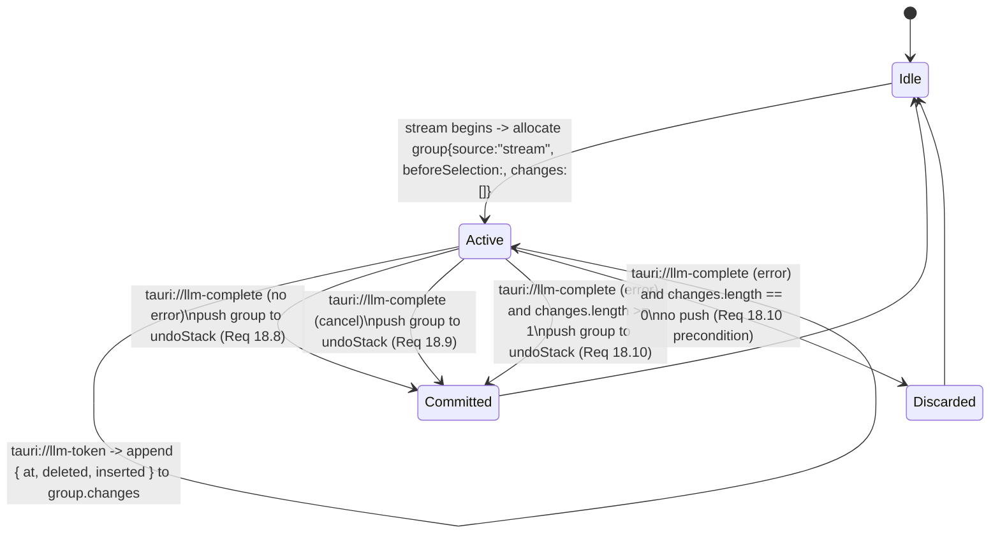
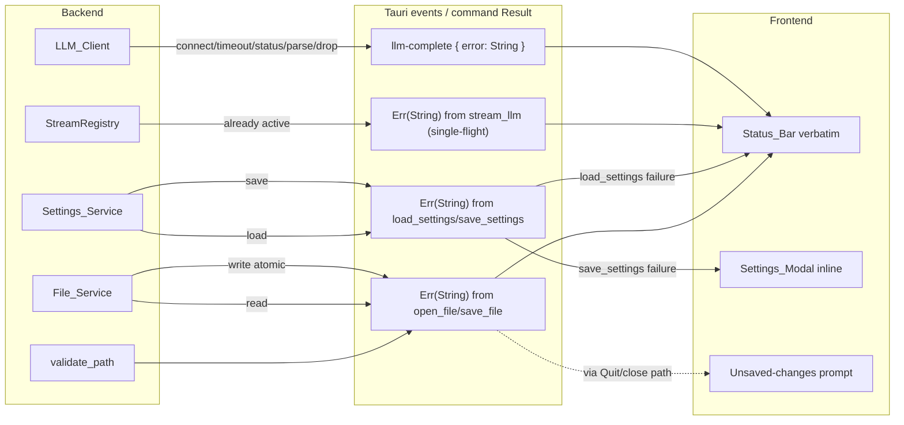

# Design Document

## Overview

LLIMEdit is a Tauri 2.x desktop application split into three concurrent boundaries:

1. **Rust process** — owns all I/O (file system, HTTP), settings persistence, and Tauri command handlers. Single Tokio runtime supplied by Tauri.
2. **WebView (frontend)** — a single HTML page with vanilla JS that owns the editor DOM, menu wiring, modal UI, and event subscriptions. No bundler, no framework.
3. **LM Studio** — an external HTTP server speaking the OpenAI `/v1/chat/completions` contract; treated as untrusted/unreliable.

The two LLIMEdit-internal boundaries communicate through Tauri's `invoke` (frontend → Rust commands) and `emit`/`listen` (Rust → frontend events). The WebView never speaks HTTP directly; all network I/O is brokered by Rust so that connection state, timeouts, and cancellation live in one place.

The design is shaped by three hard constraints from the requirements and the project README:

- **Single window, single Buffer, no tabs.** State models stay flat; no document registry, no tab list (Req 17.1).
- **Tiny footprint.** No bundler, no framework, minimal Rust crates. The editor surface is a `<textarea>`. Only Rust crates with broad ecosystem use are pulled in (Tauri, reqwest, serde, dirs).
- **Pinned APIs.** The Tauri command surface (Req 15) and the JS function surface (Req 16) are fixed contracts; everything in this design must wire up to exactly those names and shapes.

PBT is partially applicable: pure logic (settings round-trip, insertion-mode semantics on a string buffer, dirty-flag invariants, BOM/line-ending detection) is well-suited to property-based testing; UI rendering, menu wiring, native dialogs, and the live HTTP path against LM Studio are not, and use example-based or integration tests instead.

## Architecture

### High-level component diagram



### Process lifecycle

1. **Bootstrap.** `tauri::Builder` registers the six commands from Req 15, creates a `tauri::State`-managed `AppState` (settings cache + stream registry), and shows the main window. The window's HTML/CSS/JS load synchronously from the bundled assets.
2. **Settings warm-up.** On `setup`, the Rust side spawns a Tokio task that calls `Settings_Service::load()`. Until that task completes, the `AppState.settings_ready` flag is `false`. The frontend, on `DOMContentLoaded`, calls `loadSettings()`; while that future is pending, the AI menu items render disabled (Req 1.3, Req 2.6). When `loadSettings()` resolves (success or fallback), the AI menu enables (Req 1.6).
3. **Steady state.** All work is request-driven by user actions on the WebView. Rust holds no long-running tasks except an active stream task while one is in flight.
4. **Shutdown.** Window-close and Quit pass through the dirty-buffer prompt (Req 7) before allowing exit. An in-flight stream is cancelled cooperatively when the window receives a close request (its `CancellationToken` is fired alongside the prompt).

### Threading model

- Tauri commands run on Tokio worker threads. File I/O uses blocking calls wrapped in `tokio::task::spawn_blocking` to avoid stalling the runtime.
- The streaming task lives in a single `tokio::spawn` future. It owns the `reqwest::Response` and a `CancellationToken`. A `StreamRegistry` (an `Arc<Mutex<Option<StreamHandle>>>`) enforces single-flight (Req 13.8, Req 15.8).
- The frontend is single-threaded JS. All editor mutations driven by tokens go through `applyLLMResponse(mode)` so insertion semantics are centralized.
- **Undo/Redo ownership.** The `Undo_Stack` and `Redo_Stack` (Req 18) are owned entirely by the frontend, in `editor.js`, as in-memory JS arrays. They are not persisted to disk and are not visible to the Rust backend. The Rust backend has no role in undo/redo: file I/O, settings persistence, and the LLM stream pipeline never read or mutate the stacks. Open File clears both stacks at the frontend boundary (Req 18.16); Save and Save As leave them untouched (Req 18.17). Stream-driven Buffer mutations are accumulated into a single in-progress `Edit_Group` allocated when the stream begins and committed on the terminal `tauri://llm-complete` arm (Req 13.9, Req 18.7–18.10), still entirely on the frontend.

## Components and Interfaces

### Rust backend modules

```
src-tauri/src/
├── main.rs              # Tauri builder, command registration, AppState setup
├── commands.rs          # #[tauri::command] thin wrappers calling into services
├── state.rs             # AppState, StreamRegistry, BufferMeta cache
├── file_service.rs      # File_Service: read/write, BOM, line-ending detection
├── settings_service.rs  # Settings_Service: load, save (atomic), defaults, validation
├── llm_client.rs        # LLM_Client: reqwest, SSE parser, timeouts, cancellation
├── settings.rs          # Settings struct + Default + serde + validation
└── error.rs             # CommandError -> String mapping for Result<_, String>
```

#### `commands.rs` (the Req 15 surface)

Each command is a thin adapter; it validates arguments, delegates to a service, and converts service errors into the `String` returned to the frontend.

```rust
#[tauri::command]
async fn open_file(path: String) -> Result<String, String>;

#[tauri::command]
async fn save_file(path: String, contents: String) -> Result<(), String>;

#[tauri::command]
async fn call_llm(text: String, settings: Settings) -> Result<String, String>;

#[tauri::command]
async fn stream_llm(
    app: tauri::AppHandle,
    state: tauri::State<'_, AppState>,
    text: String,
    settings: Settings,
) -> Result<(), String>;

#[tauri::command]
async fn load_settings(state: tauri::State<'_, AppState>) -> Result<Settings, String>;

#[tauri::command]
async fn save_settings(
    state: tauri::State<'_, AppState>,
    settings: Settings,
) -> Result<(), String>;
```

Path validation (Req 15.7) is centralized in a helper used by `open_file` and `save_file`:

```rust
fn validate_path(p: &str) -> Result<PathBuf, String> {
    if p.is_empty() { return Err("path is empty".into()); }
    if p.contains('\0') { return Err("path contains null byte".into()); }
    let pb = PathBuf::from(p);
    if !pb.is_absolute() { return Err("path is not absolute".into()); }
    Ok(pb)
}
```

#### `file_service.rs`

Pure-ish I/O layer. Returns rich data so the frontend can update the Buffer + status bar correctly.

```rust
pub struct LoadedFile {
    pub contents: String,        // UTF-8, BOM stripped if present
    pub had_bom: bool,
    pub line_ending: LineEnding, // detected from first terminator
}

pub enum LineEnding { Lf, CrLf, Cr, None }

pub fn read_file(path: &Path) -> Result<LoadedFile, FileError>;
pub fn write_file(
    path: &Path,
    contents: &str,
    had_bom: bool,
    line_ending: LineEnding,
) -> Result<(), FileError>;
```

The Tauri command `open_file` returns only the decoded contents per Req 15.1, so `BufferMeta` (`had_bom`, `line_ending`, `path`) is held inside `AppState` keyed by path. `save_file` looks the metadata up by path before writing. (For Save As, the frontend issues `save_file` with the new path; the backend copies the active `BufferMeta` to the new path key, applying the OS-default fallback from Req 6.5 if no metadata exists.)

**Read pipeline (Req 4.5–4.7):**

1. `std::fs::read(path)` → `Vec<u8>`.
2. If the first three bytes are `EF BB BF`, set `had_bom = true` and slice them off.
3. `std::str::from_utf8` on the remaining bytes. Failure → `FileError::Encoding`.
4. Scan the resulting `&str` for the first occurrence of `\r\n`, `\n`, or `\r` and record that as `line_ending`. If none, `LineEnding::None`.
5. Return `LoadedFile { contents, had_bom, line_ending }`.

**Write pipeline (Req 5.3, 6.3, 6.5):**

1. Normalize line endings: replace every `\n` (and lone `\r`) in `contents` with the recorded `line_ending`. If `LineEnding::None`, use `\n` on macOS and `\r\n` on Windows (`#[cfg(target_os = ...)]`).
2. Encode as UTF-8 bytes; prepend `EF BB BF` if `had_bom`.
3. Atomic write: write to `path.with_extension(format!("{ext}.tmp.{pid}"))` (or sibling temp), `flush`, `sync_data`, then `std::fs::rename` over `path`. This guarantees Req 5.5 / 6.6 (no partially written file).

#### `settings_service.rs`

```rust
pub fn config_dir() -> Result<PathBuf, SettingsError>;        // dirs::config_dir() + "LLIMEdit"
pub fn settings_path() -> Result<PathBuf, SettingsError>;     // config_dir().join("settings.json")
pub fn load() -> LoadOutcome;                                  // never panics
pub fn save(s: &Settings) -> Result<(), SettingsError>;       // atomic write

pub enum LoadOutcome {
    Ok(Settings),                  // file present, valid (Req 10.6 may have filled in absent fields)
    DefaultsCreated(Settings),     // file did not exist; created with defaults (Req 10.4)
    DefaultsFromError(Settings, String), // parse/validation/IO failure -> defaults in memory (Req 10.5, 10.7)
}
```

Load logic implements Req 10.4, 10.5, 10.6, 10.7 in that order:

1. Resolve `settings_path()`; if the directory does not exist, create it (recursive). On filesystem failure, return `DefaultsFromError(Settings::default(), reason)`.
2. If the file does not exist, write `Settings::default()` to it; return `DefaultsCreated`. On write failure, return `DefaultsFromError`.
3. Read file → parse as `serde_json::Value`. Failure → `DefaultsFromError(Settings::default(), "settings parse failed: ...")`. Note: file is **not** rewritten (Req 10.5).
4. Field-by-field overlay onto `Settings::default()`: for each field, if present and validates, take it; if absent, keep default (Req 10.6); if present and invalid, treat the whole document as invalid → `DefaultsFromError`.
5. Return `Ok(merged)`.

Validation rules mirror Req 10.2, 10.3:

- `api_url`: 1..=2048 chars, parses as `url::Url`-ish absolute URL with scheme `http` or `https`. We avoid the `url` crate by writing a tiny pure-Rust check (`s.starts_with("http://") || s.starts_with("https://")` and the post-scheme portion is non-empty); this keeps dependencies small.
- `model`: 1..=256 chars.
- `temperature`: finite `f64`, `0.0 <= t <= 2.0`.
- `max_tokens`: integer `1..=1_048_576`.
- `replace_mode`: one of `insert_at_cursor` | `replace_selection` | `replace_document`.
- `system_prompt`: 0..=32_768 chars.

Save uses the same atomic write pattern as `file_service::write_file` (write `settings.json.tmp`, fsync, rename).

#### `llm_client.rs`

Owns the HTTP and SSE pipeline. One public entry point used by both `call_llm` and `stream_llm`:

```rust
pub async fn call_blocking(text: &str, settings: &Settings) -> Result<String, LlmError>;

pub async fn start_stream(
    app: tauri::AppHandle,
    text: String,
    settings: Settings,
    cancel: CancellationToken,
) -> Result<(), LlmError>;
```

`reqwest` is the HTTP client. It is configured with:

- `connect_timeout(Duration::from_secs(5))` (Req 14.1).
- `pool_idle_timeout(None)` and `tcp_nodelay(true)` for low-latency streaming.
- `redirect::Policy::limited(3)`.

Request body construction (Req 12.1, 12.2, 12.4, 12.5):

```rust
fn build_body(text: &str, s: &Settings, stream: bool) -> serde_json::Value {
    let mut messages = Vec::with_capacity(2);
    if !s.system_prompt.is_empty() {
        messages.push(json!({ "role": "system", "content": s.system_prompt }));
    }
    messages.push(json!({ "role": "user", "content": text }));
    json!({
        "model": s.model,
        "messages": messages,
        "temperature": s.temperature,
        "max_tokens": s.max_tokens,
        "stream": stream,
    })
}
```

The "non-empty selection vs whole buffer" decision (Req 12.1, 12.2, 12.3) is made on the **frontend**, because the backend does not know about the editor's selection state. The frontend computes the resolved text and short-circuits with the "Nothing to send" message before invoking `stream_llm`.

#### Streaming pipeline



The SSE parser is intentionally minimal. LM Studio emits OpenAI-compatible chunks framed as:

```
data: {"id":"...","choices":[{"delta":{"content":"hello"}}]}

data: [DONE]
```

Implementation:

1. Buffer incoming bytes from `Response::bytes_stream()` into a `String` accumulator.
2. Split on `\n\n` to get one event per record.
3. For each record, strip the leading `data: ` prefix.
4. If the payload equals `[DONE]`, complete the stream cleanly.
5. Otherwise, parse with `serde_json::from_str::<ChunkEnvelope>` and pull `choices[0].delta.content`. If `content` is `Some` and non-empty, emit `tauri://llm-token` with the fragment.
6. Any deserialization failure → abort with reason `"invalid response"` (Req 14.4).
7. Idle timer: each successful read resets `last_byte_at = Instant::now()`. The loop also `tokio::select!`s on `tokio::time::sleep_until(last_byte_at + 60s)`; if that fires, abort with `"stream timed out"` (Req 14.2).
8. `cancel.cancelled()` is also raced; on cancellation the response is dropped (closing the connection) and a `tauri://llm-complete` event with no error is emitted within 1 second (Req 13.7).

For `call_llm` (non-streaming, Req 15.3), the body is built with `stream:false`, the response is awaited as JSON, and `choices[0].message.content` is returned. Error handling reuses the same status-code/body-parse paths.

### Frontend modules

The frontend is loaded as `index.html` plus the following ES module files. No bundler; the browser loads them directly.

```
src/
├── index.html        # <body><nav><textarea><footer>
├── styles.css        # one stylesheet, no theming
├── main.js           # bootstrap: load settings, wire menus, register events
├── editor.js         # buffer state, dirty tracking, applyLLMResponse
├── status_bar.js     # status bar render + update
├── settings_modal.js # modal lifecycle + validation
├── menu.js           # menu wiring + keyboard shortcuts
└── api.js            # thin invoke() wrappers for each Tauri command
```

#### `editor.js` — Editor module

State held in module-scoped variables (single-Buffer constraint, Req 17.1):

```js
let bufferEl;            // <textarea>
let currentPath = null;  // string | null
let savedSnapshot = "";  // last loaded/saved contents
let hadBom = false;      // mirrors backend BufferMeta
let lineEnding = "none";
let streamActive = false;
let streamAnchor = null; // { mode, startCursor, startSelection, insertedLength }
```

Public surface (Req 16.1):

```js
export function openFile();
export function saveFile();
export function saveFileAs();
export function sendToLLM();
export function applyLLMResponse(mode);  // mode-validated, see Req 16.3
export function loadSettings();
export function saveSettings();
```

Dirty-flag tracking (Req 8.6, 8.7) is computed, not flagged: `isDirty()` returns `bufferEl.value !== savedSnapshot`. The status bar reads this on every `input` event, so undo back to the saved state automatically clears the asterisk (Req 8.7) without bookkeeping.

`applyLLMResponse(mode, fragment)` validates `mode` synchronously (Req 16.3) and dispatches:

```js
export function applyLLMResponse(mode, fragment) {
  if (mode !== "insert_at_cursor"
      && mode !== "replace_selection"
      && mode !== "replace_document") {
    throw new Error(`invalid Insertion_Mode: ${mode}`);
  }
  // dispatch to applyInsertAtCursor / applyReplaceSelection / applyReplaceDocument
}
```

The three appliers operate on `bufferEl.value` directly using the cursor/selection captured at stream start (`streamAnchor`):

- `insert_at_cursor`: splice fragment in at `streamAnchor.startCursor + streamAnchor.insertedLength`, then advance `insertedLength` by `[...fragment].length` (Unicode code-point count, Req 13.2).
- `replace_selection`: on first token, replace `[startSelection.start, startSelection.end)` with fragment; on subsequent tokens, splice at `startSelection.start + insertedLength`. Empty selection collapses to the insert-at-cursor case (Req 13.3).
- `replace_document`: on first token, set `bufferEl.value = fragment`; on subsequent tokens, append (Req 13.4).

After every application, `dispatchEvent(new Event('input'))` to refresh status-bar character count, and the splice (`{ at, deleted, inserted }`) is appended to the in-progress stream `Edit_Group` held by `streamAnchor.group` (see "Undo/Redo state" under Data Models) so that the entire stream commits as a single Undo step on `tauri://llm-complete` (Req 13.9, Req 18.7–18.10).

#### `editor.js` — `UndoRedoStack` submodule

`editor.js` owns two arrays of `Edit_Group` records, `undoStack` and `redoStack`, both bounded to a maximum capacity of 200 with FIFO eviction on overflow (Req 18.18–18.20). Both are initialized to `[]` at module load (Req 18.1).

```js
const UNDO_REDO_CAPACITY = 200;

const undoStack = []; // EditGroup[]
const redoStack = []; // EditGroup[]

function pushOnto(stack, group) {
  if (stack.length >= UNDO_REDO_CAPACITY) {
    stack.shift(); // FIFO: drop oldest
  }
  stack.push(group);
}

function pushUndo(group, { fromRedo = false } = {}) {
  pushOnto(undoStack, group);
  if (!fromRedo) {
    redoStack.length = 0; // Req 18.15
  }
}
```

**Edit_Group shape (Req 18 Glossary, mapped to JS):**

```ts
type EditGroup = {
  source: "typing" | "paste" | "cut" | "stream";
  beforeSelection: { start: number; end: number };  // pre-application cursor/selection
  afterSelection:  { start: number; end: number };  // post-application cursor/selection
  changes: Array<{ at: number; deleted: string; inserted: string }>;
  lastAppendedAt: number; // ms since epoch; used only for typing-grouping
};
```

The `changes` array is ordered: applying it forward (left-to-right) reproduces the group's effect on the buffer; applying it in reverse (right-to-left, swapping `deleted` and `inserted`) reverts the group.

**Typed-input grouping (Req 18.2–18.4).** A keystroke that produces a printable character is routed through `recordTypedKeystroke(keyEvent, change)`. The function appends to the current top group of `undoStack` if and only if all of:

1. `undoStack` is non-empty and `top.source === "typing"`.
2. `Date.now() - top.lastAppendedAt <= 1000`.
3. No cursor-jump signal has fired since the previous append (see below).
4. The current key is not the Enter key (Req 18.4).

Otherwise, a new typing group is pushed. Cursor-jump signals come from a single internal flag, `cursorJumped`, set to `true` by any of: `keydown` for ArrowUp/ArrowDown/ArrowLeft/ArrowRight, Home, End, PageUp, PageDown; `mousedown` or `click` on the textarea; any programmatic `setSelectionRange` or `selectionStart/End` write; the `select` event firing with a different selection from the previously-recorded one. The flag is cleared after the next typed keystroke is evaluated. Enter (`event.key === "Enter"`) always begins a new group and sets `cursorJumped = false` afterward (Req 18.4).

**Paste and Cut (Req 18.5, 18.6).** The `paste` handler computes the splice produced by clipboard insertion (`{ at, deleted, inserted }`) and pushes a new `EditGroup` with `source: "paste"` containing exactly that single change. The `cut` handler does the same with `source: "cut"` only when the selection is non-zero-length (zero-length cut is a no-op per Req 8.4 and produces no group).

**Stream-grouping (Req 13.9, Req 18.7–18.10).** When a stream begins (`sendToLLM` resolves), `editor.js` allocates `streamAnchor.group: EditGroup` with `source: "stream"`, `beforeSelection` set to the cursor/selection captured at stream start, and an empty `changes` array. Each of the three insertion-mode appliers (`applyInsertAtCursor`, `applyReplaceSelection`, `applyReplaceDocument`) appends one `{ at, deleted, inserted }` entry to `streamAnchor.group.changes` per token applied, regardless of `replace_mode`. On `tauri://llm-complete`:

- If `streamAnchor.group.changes.length >= 1`, the handler sets `afterSelection` to the post-stream cursor/selection and calls `pushUndo(streamAnchor.group)`. This holds for end-of-stream (Req 18.8), user cancellation (Req 18.9), and any Req 14 error reason (Req 18.10).
- If `changes.length === 0` (the stream errored before any token arrived), nothing is pushed — Req 18.10 explicitly conditions on "one or more `tauri://llm-token` events were received".

**`undo()` (Req 18.11, Req 18.21).**

```js
export function undo() {
  if (streamActive) return;            // Req 18.21 + Req 12.6
  const group = undoStack.pop();
  if (!group) return;                  // Req 18.12 no-op
  applyChangesReverse(group.changes);  // splice in reverse order, swap deleted<->inserted
  setSelection(group.beforeSelection); // restore pre-application selection
  pushOnto(redoStack, group);
  bufferEl.dispatchEvent(new Event("input"));
}
```

**`redo()` (Req 18.13, Req 18.21).**

```js
export function redo() {
  if (streamActive) return;            // Req 18.21
  const group = redoStack.pop();
  if (!group) return;                  // Req 18.14 no-op
  applyChangesForward(group.changes);  // splice in original order
  setSelection(group.afterSelection);  // restore post-application selection
  pushUndo(group, { fromRedo: true }); // does NOT clear redoStack
  bufferEl.dispatchEvent(new Event("input"));
}
```

**Open File / Save (Req 18.16, 18.17).** The `tauri://file-opened` handler (and the `openFile` success path) calls `undoStack.length = 0; redoStack.length = 0;` after the buffer replacement. `saveFile` and `saveFileAs` are the only edit-related actions that leave both stacks untouched on every code path, regardless of the underlying `save_file` outcome.

**Intercepting the textarea's built-in undo/redo.** Browsers fire `beforeinput` events with `inputType: "historyUndo"` and `inputType: "historyRedo"` when the user invokes Cmd/Ctrl+Z / Cmd/Ctrl+Shift+Z (or Cmd/Ctrl+Y on Windows) inside a `<textarea>`. If left alone, the browser performs its own partial undo against its private history, immediately drifting from our `undoStack`. We replace this by registering a `beforeinput` listener on `bufferEl`:

```js
bufferEl.addEventListener("beforeinput", (e) => {
  if (e.inputType === "historyUndo") { e.preventDefault(); undo(); return; }
  if (e.inputType === "historyRedo") { e.preventDefault(); redo(); return; }
  // ... other inputTypes flow through normally
});
```

The keyboard handlers in `menu.js` also bind Cmd/Ctrl+Z and Cmd/Ctrl+Shift+Z (plus Cmd/Ctrl+Y on Windows) and call `editor.undo()` / `editor.redo()` directly; the `beforeinput` interception is the safety net for menu-bar invocations and any platform-specific shortcut path that bypasses our keydown listener.

#### `status_bar.js`

A function `renderStatusBar({ path, charCount, model, dirty, error })` writes the formatted string into the footer. The bar is the only error surface for backend failures; `error` (when present) is shown verbatim per Req 14.6.

#### `settings_modal.js`

Holds the modal DOM, runs validation (matching the backend rules), and on Save calls `api.saveSettings(values)`. On success, closes; on failure, stays open and shows the failure reason inline (Req 11.9). Cancel and Escape both close without writing (Req 11.8). Inline validation errors (Req 11.4–11.7) are rendered next to the offending field; nothing is sent to the backend until validation passes.

#### `menu.js`

Builds the menu bar HTML and binds click + keyboard handlers. Shortcut binding uses `event.metaKey` on macOS (`navigator.platform.toLowerCase().includes('mac')`) and `event.ctrlKey` on Windows. On match, the handler:

1. Checks the gating predicate (Req 3.6, 3.7): if `settingsModalOpen` or `streamActive`, the handler `return`s without acting (and without `preventDefault`, except for the document-modifying shortcuts where we still call `preventDefault` so the browser does not perform a built-in "save page" or similar).
2. Otherwise, calls `event.preventDefault()` and dispatches the action.

The Edit menu's **Undo** and **Redo** items dispatch to `editor.undo()` and `editor.redo()` respectively. Their keyboard bindings:

| Action | macOS                | Windows                                   |
|--------|----------------------|-------------------------------------------|
| Undo   | `Cmd+Z`              | `Ctrl+Z`                                  |
| Redo   | `Cmd+Shift+Z`        | `Ctrl+Shift+Z` and `Ctrl+Y` (both bound) |

Binding both `Ctrl+Shift+Z` and `Ctrl+Y` for Redo on Windows preserves muscle memory across users coming from different application conventions. The same gating predicates apply: while a stream is active, both menu items and both shortcuts are no-ops at the `editor.js` boundary (Req 18.21), and `menu.js` additionally calls `event.preventDefault()` on the matching keydown so the browser's built-in textarea history does not run. The `beforeinput` interceptor described in `editor.js` covers any path that still reaches the textarea (e.g., the macOS Edit menu's native "Undo" item routed through the WebView).

Escape handling (Req 3.5, 3.8, 11.8) is shared:

- If `settingsModalOpen`, close the modal (Req 11.8) — handled by `settings_modal.js`.
- Else if `streamActive`, send a `cancel_stream` message to the backend, which fires the `CancellationToken` (Req 13.7).
- Else no-op (Req 3.8).

(`cancel_stream` is implemented as a seventh internal command not listed in Req 15; Req 15 specifies the minimum surface, not a maximum. The cancellation pathway must still emit `tauri://llm-complete` per Req 13.7, so the command simply triggers the existing token.)

### Cross-platform notes

- **Menus.** Tauri's native menu API differs slightly between macOS (mac app menu in the system bar) and Windows (in-window menu). For v0.1 we render the menu bar in HTML to keep platform parity; the OS-level menu remains the default Tauri-generated one for Quit/standard actions on macOS. The HTML menu and the keyboard shortcuts are the canonical UI per Req 2.
- **Shortcut modifier.** `Cmd` on macOS, `Ctrl` on Windows. Detected once at startup.
- **Config directory.** `dirs::config_dir()` resolves to `~/Library/Application Support` on macOS and `%APPDATA%` on Windows; we append `LLIMEdit/` (Req 10.1).
- **Default line ending for new files** (Req 6.5). `cfg!(target_os = "macos")` → `\n`, `cfg!(target_os = "windows")` → `\r\n`.
- **File picker.** Tauri's `tauri-plugin-dialog` provides `FileDialogBuilder` with cross-platform filters; the same call works on both targets.

## Data Models

### Settings

```rust
#[derive(Debug, Clone, PartialEq, Serialize, Deserialize)]
pub struct Settings {
    pub api_url: String,
    pub model: String,
    pub temperature: f64,
    pub max_tokens: u32,
    pub replace_mode: ReplaceMode,
    pub system_prompt: String,
}

#[derive(Debug, Clone, Copy, PartialEq, Eq, Serialize, Deserialize)]
#[serde(rename_all = "snake_case")]
pub enum ReplaceMode {
    InsertAtCursor,
    ReplaceSelection,
    ReplaceDocument,
}

impl Default for Settings {
    fn default() -> Self {
        Self {
            api_url: "http://localhost:1234/v1/chat/completions".into(),
            model: "local-model".into(),
            temperature: 0.2,
            max_tokens: 2048,
            replace_mode: ReplaceMode::ReplaceDocument,
            system_prompt: String::new(),
        }
    }
}
```

`Settings::validate(&self) -> Result<(), Vec<FieldError>>` enforces Req 10.2, 10.3 bounds. It is called on every `save_settings` and during the parse-time field overlay in `Settings_Service::load`.

### BufferMeta (backend cache)

```rust
pub struct BufferMeta {
    pub had_bom: bool,
    pub line_ending: LineEnding,
}

pub struct AppState {
    pub settings: RwLock<Settings>,
    pub buffer_meta: Mutex<HashMap<PathBuf, BufferMeta>>,
    pub stream: StreamRegistry,
}
```

Only the metadata for the currently-open file is needed at any instant (single-Buffer rule), but indexing by `PathBuf` keeps the bookkeeping straightforward when the user does Open → Save As → Save.

### StreamRegistry / StreamHandle

```rust
pub struct StreamHandle {
    pub cancel: CancellationToken,
}

#[derive(Default)]
pub struct StreamRegistry(Mutex<Option<StreamHandle>>);

impl StreamRegistry {
    pub fn try_acquire(&self) -> Result<CancellationToken, AlreadyActive>;
    pub fn release(&self);
    pub fn cancel(&self); // fires the token without releasing; release happens when the task ends
}
```

Single-flight (Req 13.8, Req 15.8) is enforced inside `try_acquire`: if `Some(_)` is already there, return `Err(AlreadyActive)`.

### Frontend state shape

A single module-scoped object in `editor.js`; not formalized as a class because the Buffer is a singleton (Req 17.1).

```ts
type EditorState = {
  bufferEl: HTMLTextAreaElement;
  currentPath: string | null;
  savedSnapshot: string;     // contents at last load/save
  hadBom: boolean;
  lineEnding: "lf" | "crlf" | "cr" | "none";
  streamActive: boolean;
  streamAnchor: null | {
    mode: "insert_at_cursor" | "replace_selection" | "replace_document";
    startCursor: number;     // code-point offset
    startSelection: { start: number; end: number };
    insertedLength: number;  // code points inserted so far
    group: EditGroup;        // in-progress Edit_Group for this Stream (Req 13.9, Req 18.7)
  };
  undoStack: EditGroup[];    // Req 18.1, capacity 200 with FIFO eviction
  redoStack: EditGroup[];    // Req 18.1, capacity 200 with FIFO eviction
  cursorJumped: boolean;     // typed-input grouping signal (Req 18.2)
};
```

The `streamAnchor.mode`, `startCursor`, `startSelection`, and `insertedLength` fields are still required for the per-token splice math in the three insertion-mode appliers (Req 13.2–13.4); the new `group` field is the accumulator that Req 13.9 commits onto `undoStack` on stream terminate.

### Undo/Redo state

The `EditGroup` type and the `Undo_Stack` / `Redo_Stack` arrays form the entirety of the in-memory undo/redo state defined in Requirement 18. They live exclusively in `editor.js` (see "Architecture / Threading model" — Undo/Redo ownership) and are never persisted or sent to Rust.

**`EditGroup` shape:**

```ts
type EditGroup = {
  source: "typing" | "paste" | "cut" | "stream";
  beforeSelection: { start: number; end: number };
  afterSelection:  { start: number; end: number };
  changes: Array<{ at: number; deleted: string; inserted: string }>;
  lastAppendedAt: number; // ms since epoch, used only when source === "typing"
};
```

- `source` records which of the four pathways defined in Req 18.2–18.10 produced the group; it is consulted by the typed-input grouping rule (only `"typing"` groups can be appended to) and used to tag failures during testing.
- `beforeSelection` is the cursor/selection state at the moment the first change in the group was about to be applied. It is the state Undo restores to (Req 18.11). For a typing group, it is captured when the first keystroke is recorded; for paste/cut, when the action is invoked; for a stream, when the stream begins.
- `afterSelection` is the cursor/selection state at the moment the group was committed. It is the state Redo restores to (Req 18.13). For typing it is updated on every append; for paste/cut it is set on the single push; for a stream it is set at `tauri://llm-complete` time.
- `changes` is an ordered list of buffer splices. Forward application replays the original effect; reverse application (iterating right-to-left and swapping `deleted`/`inserted`) is the undo operation.
- `lastAppendedAt` enables the 1000ms typing-grouping window of Req 18.2.

**Stack capacity and eviction (Req 18.18–18.20).** Both `undoStack` and `redoStack` are bounded to exactly 200 entries. Pushes are FIFO-evicting: when a push would exceed the bound, the bottom-most (oldest) entry is dropped before the new entry is appended on top. This applies to all push pathways — typed/paste/cut/stream onto `undoStack`, and Undo's transfer of the popped group onto `redoStack`.

**Stream-Edit_Group lifecycle (Req 13.9, Req 18.7–18.10).**



Exactly one terminal transition fires per stream, so exactly zero or one entry is pushed onto `undoStack` per stream. The push, when it fires, also clears `redoStack` (Req 18.15 applied to the stream pathway).

### LLM SSE chunk envelope

```rust
#[derive(Deserialize)]
struct ChunkEnvelope {
    choices: Vec<ChunkChoice>,
}
#[derive(Deserialize)]
struct ChunkChoice {
    delta: ChunkDelta,
}
#[derive(Deserialize)]
struct ChunkDelta {
    content: Option<String>,
}
```

Only `delta.content` is consumed; `role`, `finish_reason`, and other fields are intentionally ignored to keep the parser lenient against minor schema drift.


## Error Handling

Errors in LLIMEdit have three distinct surfaces: the **Status_Bar** (verbatim, for backend or stream failures), the **Settings_Modal** (inline, adjacent to the offending field), and the **unsaved-changes prompt** (for save failures triggered during Quit/close, which fall back to the Status_Bar after the prompt resolves). The design keeps every error path non-destructive: the Buffer is never reverted, no in-flight save touches the on-disk file until atomic rename succeeds, and a stream that fails mid-way leaves already-inserted tokens in place (Req 14.7).

### Source-to-presentation map



### Backend error catalog

The error reasons emitted on `tauri://llm-complete` are fixed string literals (or status-code-bearing strings) by Req 14, and **must** be produced by exactly one source each. The table below is the contract.

| Source                                            | Trigger                                                                          | Surface                          | Reason / message                                       | Requirement |
|---------------------------------------------------|----------------------------------------------------------------------------------|----------------------------------|--------------------------------------------------------|-------------|
| `LLM_Client` connect timeout (5s)                 | `reqwest::Error::is_connect()` or elapsed `connect_timeout`                      | `llm-complete` → Status_Bar      | `"connection failed"`                                  | 14.1        |
| `LLM_Client` idle timeout (60s)                   | no bytes from response stream for 60s                                            | `llm-complete` → Status_Bar      | `"stream timed out"`                                   | 14.2        |
| `LLM_Client` non-200 status                       | `Response::status() != 200`                                                      | `llm-complete` → Status_Bar      | string containing the decimal status, e.g. `"HTTP 503"`| 14.3        |
| `LLM_Client` body parse failure                   | `serde_json::from_str::<ChunkEnvelope>` fails on a `data:` payload               | `llm-complete` → Status_Bar      | `"invalid response"`                                   | 14.4        |
| `LLM_Client` connection drop                      | byte stream ends before `[DONE]` and no other reason matched                     | `llm-complete` → Status_Bar      | `"connection lost"`                                    | 14.5        |
| `File_Service` invalid UTF-8                      | `std::str::from_utf8` fails after BOM strip                                      | `open_file` → Status_Bar         | `"file is not valid UTF-8"`                            | 4.8, 15.1   |
| `File_Service` IO read failure                    | `std::fs::read` error (not-found, permission denied, IO)                         | `open_file` → Status_Bar         | `"could not read file: {os_error}"`                    | 4.9, 15.1   |
| `File_Service` IO write failure                   | error during temp write, fsync, or atomic rename                                 | `save_file` → Status_Bar         | `"could not save file: {os_error}"`                    | 5.5, 6.6, 15.2 |
| `validate_path` empty / non-absolute / null byte  | path argument fails the `validate_path` helper                                   | `open_file`/`save_file` → Status_Bar | `"path is empty"` / `"path is not absolute"` / `"path contains null byte"` | 15.7 |
| `Settings_Service::load` IO/parse failure         | directory create, read, or parse error                                           | `load_settings` → Status_Bar     | `"settings could not be loaded; using defaults"` plus the underlying reason | 10.5, 10.7 |
| `Settings_Service::save` IO failure               | atomic write fails                                                               | `save_settings` → Settings_Modal | `"settings could not be saved: {os_error}"`            | 10.7, 11.9  |
| `StreamRegistry` already active                   | `try_acquire` returns `AlreadyActive`                                            | `stream_llm` Err → Status_Bar    | `"a stream is already active"` (frontend may also short-circuit with `"A request is already in progress"` per Req 12.7) | 13.8, 15.8 |
| Settings_Modal inline validation                  | client-side check on `temperature`, `max_tokens`, `api_url`, `model`              | inline message next to field     | per-field message; modal stays open                    | 11.4–11.7   |
| Save failure during Quit/close                    | `save_file` Err propagated from the prompt                                       | unsaved-changes prompt aborts; Status_Bar shows reason | per `save_file` reason above                           | 7.6         |

### Atomic-write rollback (Req 5.5, 6.6)

The write pipeline never opens the destination path for write. It writes to a sibling temp file, fsyncs, and then performs `std::fs::rename`. If any step fails:

1. The temp file is removed (best-effort) so no garbage accumulates.
2. The destination path remains exactly as it was before the save attempt.
3. The Buffer remains a Dirty_Buffer (Req 5.5, 6.6).
4. The reason is propagated to the Status_Bar verbatim.

`Settings_Service::save` uses the same pattern, so a power failure mid-save can never leave a corrupt `settings.json` (it can leave a stale one, which subsequent loads handle per Req 10.5).

### Undo/Redo bounds-check fallback

`undo()` and `redo()` apply each `change` in an `Edit_Group` as a buffer splice at `change.at`. In a correctly functioning editor the recorded `at` and `deleted` are always consistent with the buffer state at the moment the splice is replayed, but a programming bug (missed cursor accounting, an unrecorded buffer mutation, a mishandled stream terminal arm) could produce a group whose splice would go out-of-range or whose `deleted` field does not match the buffer slice it claims to replace. To keep the buffer non-destructive in that case, `undo()` and `redo()` validate each change before applying it:

1. The target slice `bufferEl.value.slice(at, at + [...deleted].length)` must equal `change.deleted` (a code-point-level checksum on the `before` snapshot).
2. `at >= 0 && at + [...deleted].length <= codepointLen(bufferEl.value)`.

If either check fails for any change in the group, the implementation **aborts the entire group's application without mutating the buffer**, leaves both `undoStack` and `redoStack` exactly as they were before the invocation (no transfer), logs `console.error("undo/redo aborted: stale change", { source, at, expected: change.deleted, actual })`, and surfaces a user-visible warning in the Status_Bar reading `"undo/redo state desynchronized; please retry"`. This prevents Buffer corruption in the presence of an undiscovered editor bug. The condition is treated as a programming-error signal, not as a normal outcome — every passing P14/P15/P16 test run guarantees the path is unreachable in correctly-recorded groups.

### Stream error semantics

`tauri://llm-complete` is the single terminal event for any active stream, success or failure (Req 13.5, 13.7, 14.6). The pipeline guarantees exactly-one delivery using a `tokio::select!` with these arms, in priority order:

1. `cancel.cancelled()` — user pressed Escape; emit `llm-complete` with no reason.
2. idle-timeout sleep — emit `"stream timed out"`.
3. body-stream `Some(Ok(chunk))` — parse; on `[DONE]` emit clean complete; on parse error emit `"invalid response"`.
4. body-stream `Some(Err(_))` — connection drop; emit `"connection lost"`.
5. body-stream `None` (EOF without `[DONE]`) — also `"connection lost"`.

The connect-timeout (Req 14.1) and non-200 status (Req 14.3) are detected synchronously before entering the stream loop, so they exit early with their respective reasons. After the terminal emit, `StreamRegistry::release()` is called unconditionally so the next Send to Model is accepted (Req 14.6).

### Frontend handling

The single `tauri://llm-complete` listener does three things, in order:

```js
function onLlmComplete(evt) {
  streamActive = false;
  bufferEl.disabled = false;
  if (evt.payload && evt.payload.error) {
    statusBar.setError(evt.payload.error); // verbatim, Req 14.6
  }
}
```

Tokens are not rolled back: `streamAnchor` is simply discarded. Anything already written to the textarea stays (Req 14.7).

The Settings_Modal has its own error channel: validation errors render adjacent to fields and never reach the Status_Bar; a backend save failure renders inline at the modal footer and keeps the modal open (Req 11.9), preserving in-modal edits so the user can retry.

## Correctness Properties

*A property is a characteristic or behavior that should hold true across all valid executions of a system — essentially, a formal statement about what the system should do. Properties serve as the bridge between human-readable specifications and machine-verifiable correctness guarantees.*

The properties below cover the pure-logic parts of LLIMEdit where input variation reveals real bugs: settings serialization, file metadata round-trips, insertion-mode application, dirty-flag computation, path validation, and request body construction. UI rendering, native dialogs, the menu bar, and the live HTTP path against LM Studio are intentionally excluded from PBT and instead covered by integration and example tests in the Testing Strategy.

### Property 1: Settings serialize-then-parse round-trip

*For any* valid `Settings` value `s`, `serde_json::from_str::<Settings>(&serde_json::to_string(&s).unwrap()).unwrap() == s`.

Input strategy: a `proptest` strategy `arb_settings()` composing `arb_api_url()` (one of `"http://"` / `"https://"` followed by a non-empty 1..2040-char host/path), `arb_model()` (1..256 ASCII chars), `arb_temperature()` (`0.0..=2.0` finite `f64`), `arb_max_tokens()` (`1..=1_048_576u32`), `arb_replace_mode()` (one of three variants), `arb_system_prompt()` (0..32_768 chars).

**Validates: Requirements 10.8**

### Property 2: Settings field validation matches its bounds

*For any* candidate value `v` for any settings field `f`, `Settings::validate_field(f, v).is_ok()` if and only if `v` lies inside the bounds defined for `f` in Req 10.2/10.3.

Input strategy: per-field generators producing a 50/50 mix of in-bounds and out-of-bounds values: `temperature` from `prop_oneof![ -10.0..0.0, 0.0..=2.0, 2.0..10.0, just(f64::NAN), just(f64::INFINITY) ]`; `max_tokens` from `prop_oneof![ 0..1u32, 1..=1_048_576, 1_048_577..u32::MAX ]`; `model` lengths drawn from `0..=300`; `api_url` from a mix of valid `http(s)://…` strings, schemeless strings, `ftp://…`, empty, and over-2048-char strings; `replace_mode` from a mix of the three valid variants and arbitrary other strings; `system_prompt` length from `0..=33_000`.

**Validates: Requirements 10.2, 10.3**

### Property 3: Settings absent-field substitution preserves present-and-valid fields

*For any* valid `Settings` value `s` and any subset `D ⊆ field_set` of fields to drop, parsing the JSON produced by serializing `s` and then deleting keys in `D` yields a `Settings` whose fields in `D` equal the defaults and whose fields outside `D` equal `s`.

Input strategy: `arb_settings()` paired with a `prop::collection::hash_set(arb_field_name(), 0..=6)`.

**Validates: Requirements 10.6**

### Property 4: File round-trip preserves contents, BOM, and line ending

*For any* `(contents: String, had_bom: bool, line_ending: LineEnding)` where `contents` does not itself contain mismatched line terminators, `read_file(write_file(contents, had_bom, line_ending))` returns `LoadedFile { contents: normalize(contents, line_ending), had_bom, line_ending }`.

Input strategy: a generator producing `contents` as a sequence of 0..200 segments, each either a non-terminator string (drawn from `[^\r\n]*`) or the chosen `line_ending`'s terminator; `had_bom: bool`; `line_ending: prop_oneof![Just(Lf), Just(CrLf), Just(Cr)]`. The `LineEnding::None` case is covered separately by an example test because the round trip degenerates.

**Validates: Requirements 4.6, 5.3**

### Property 5: Line-ending detection picks the first terminator

*For any* string `s` containing at least one of `\r\n`, `\n`, or `\r`, `detect_line_ending(s)` equals the kind of the earliest terminator encountered when scanning left to right (treating `\r\n` as a single terminator).

Input strategy: generate a prefix (`[^\r\n]*`), pick a target terminator, then generate a suffix (any string), concatenate, and assert against a small reference scanner.

**Validates: Requirements 4.7**

### Property 6: Path validation rejects invalid paths

*For any* string `p`, `validate_path(p).is_err()` if and only if `p.is_empty() || p.contains('\0') || !PathBuf::from(p).is_absolute()`.

Input strategy: union of (a) absolute paths produced by `prop_oneof![ "/[a-zA-Z0-9_/.-]{1,80}", "[A-Z]:\\\\[a-zA-Z0-9_\\\\.-]{1,80}" ]`, (b) relative paths `"[a-zA-Z0-9_./-]{1,80}"`, (c) empty string, (d) any of the above with one or more `\0` bytes spliced in at a random position.

**Validates: Requirements 15.7**

### Property 7: `insert_at_cursor` is splice-at-anchor for any token sequence

*For any* initial `(buffer: String, cursor: usize_in_codepoints)` and any sequence of token fragments `t₁, t₂, …, tₙ`, applying the tokens in order via the `insert_at_cursor` applier yields a final buffer equal to inserting the concatenation `t₁ ++ t₂ ++ … ++ tₙ` at `cursor` in the original buffer, and the running anchor after token `k` equals `cursor + codepoint_len(t₁ ++ … ++ tₖ)`.

Input strategy: `arb_buffer()` (a 0..2000-char Unicode string), `cursor` drawn uniformly from `0..=codepoint_len(buffer)`, `tokens` from `prop::collection::vec(arb_fragment(), 0..30)`.

**Validates: Requirements 13.2**

### Property 8: `replace_selection` replaces (or inserts on empty selection) and then appends

*For any* initial `(buffer, selStart, selEnd)` with `0 ≤ selStart ≤ selEnd ≤ codepoint_len(buffer)` and any token sequence `t₁..tₙ`, the final buffer equals `buffer[..selStart] ++ t₁ ++ … ++ tₙ ++ buffer[selEnd..]`. The empty-selection case (`selStart == selEnd`) collapses to `insert_at_cursor` at `selStart`.

Input strategy: `arb_buffer()`, then a pair `(a, b)` drawn from `(0..=N) × (0..=N)` with `selStart = min(a,b)` and `selEnd = max(a,b)`; tokens as in Property 7. Includes a deliberately weighted branch where `a == b` to oversample the empty-selection edge case.

**Validates: Requirements 13.3**

### Property 9: `replace_document` token concatenation is split-insensitive

*For any* full text `T: String` and any partition of `T` into a non-empty list of fragments `[t₁, t₂, …, tₙ]` such that `t₁ ++ t₂ ++ … ++ tₙ == T`, applying the fragments in order via the `replace_document` applier (starting from any initial buffer) yields a final buffer equal to `T`.

Input strategy: `arb_buffer()` for the initial buffer; `T` from `arb_buffer()`; partition `T` by drawing a sorted vector of `0..30` distinct cut points in `0..=codepoint_len(T)` and slicing accordingly. Includes the degenerate single-fragment case.

**Validates: Requirements 13.4**

### Property 10: Dirty-flag invariant

*For any* pair of strings `(current, snapshot)`, `isDirty(current, snapshot) === (current !== snapshot)`.

Input strategy: two arbitrary `String`s from a single shared generator (so collisions are sampled), plus a deliberately weighted branch where `snapshot` is set equal to `current` to oversample the `false` case.

**Validates: Requirements 8.6, 8.7**

### Property 11: `applyLLMResponse` rejects invalid modes synchronously

*For any* string `mode` and any current buffer state `B`, if `mode ∉ { "insert_at_cursor", "replace_selection", "replace_document" }`, then `applyLLMResponse(mode, "x")` throws synchronously and the buffer state after the throw equals `B`. If `mode` is in the allowed set, no throw occurs.

Input strategy: `mode` from `prop_oneof![ Just("insert_at_cursor"), Just("replace_selection"), Just("replace_document"), "[a-z_]{1,32}" ]` with the catch-all branch weighted to oversample invalid strings.

**Validates: Requirements 16.3**

### Property 12: `build_body` request structure invariants

*For any* `(text: String, settings: Settings, stream: bool)`, the JSON value produced by `build_body(text, settings, stream)` satisfies: `body["model"] == settings.model`; `body["temperature"] == settings.temperature`; `body["max_tokens"] == settings.max_tokens`; `body["stream"] == stream`; `body["messages"]` is an array whose last element is `{ "role": "user", "content": text }`; the array has length 2 if `settings.system_prompt` is non-empty (with a leading `{ "role": "system", "content": settings.system_prompt }`) and length 1 otherwise.

Input strategy: `arb_settings()` (with `system_prompt` weighted to sample both empty and non-empty), `text: ".*"` 0..4096 chars, `stream: bool`.

**Validates: Requirements 12.1, 12.2, 12.4, 12.5**

### Property 13: Frontend/backend settings-validator parity

*For any* settings field `f` and value `v`, the JS validator in `settings_modal.js` and the Rust validator in `settings.rs` agree on accept/reject.

Input strategy: a shared JSON corpus, generated once and consumed by both languages. The Rust test (proptest) emits a JSON file of `(field, value)` cases and their `Ok/Err`; the JS test (Vitest) reads the same file and asserts identical decisions field by field.

**Validates: Requirements 11.4, 11.5, 11.6, 11.7, 10.2, 10.3**

### Property 14: Apply-then-undo is identity

*For any* initial Editor state `(buffer, selection)` and any `EditGroup g` produced by the typed-input, paste, cut, or stream pathway, applying `g` and then invoking `undoOne()` yields a final `(buffer', selection')` equal to the original `(buffer, selection)`.

Input strategy: an `arbEditorState()` strategy producing `buffer: ".*"` (0..2000 chars) and a `selection` drawn from `0..=codepointLen(buffer)` paired such that `start <= end`; an `arbEditGroup(state)` strategy producing one of four sub-generators chosen uniformly:

- `arbTypingGroup(state)` — a sequence of 1..30 (char, dt_ms ∈ 0..2000, isEnter, cursorJumpBefore) tuples driven through `recordTypedKeystroke` until the grouping rule starts a new group; only the first resulting group is taken.
- `arbPasteGroup(state)` — a clipboard payload `".*"` 0..200 chars and the current selection, producing a single splice.
- `arbCutGroup(state)` — restricted to states with a non-empty selection, producing the deletion splice.
- `arbStreamGroup(state)` — a `replace_mode` from the three variants, plus a token sequence `Vec<".*">` of length 1..30; each token is applied via the corresponding insertion-mode applier and recorded into the stream's group.

After applying `g`, exactly one `undo()` is invoked and the resulting state is compared to the captured pre-application state. The capacity rule (Req 18.18–18.20) is asserted as a sub-invariant after every push performed by the generator.

**Validates: Requirements 18.11, 18.13**

### Property 15: n-step Undo-Redo round-trip on a stack of groups is identity

*For any* sequence of `EditGroup`s `[g₁, g₂, …, gₙ]` legally produced by the Editor (n ∈ 0..50), applying them in order, then performing exactly `n` `undo()` invocations followed by exactly `n` `redo()` invocations, yields a final `(buffer, selection)` equal to the state after the original forward application.

Input strategy: an iterated `arbEditGroup` chain that threads the `(buffer, selection)` through each step (so each generated group is legal against the post-state of the previous one). Group sources are weighted to oversample stream and typing groups since those have the most internal structure. The property additionally checks that each forward `redo()` does **not** clear `redoStack` (Req 18.15 exception for the redo pathway), and that capacity invariants hold throughout.

**Validates: Requirements 18.11, 18.13**

### Property 16: Stream commit invariant

*For any* sequence of token fragments `[t₁, t₂, …, tₙ]` with `n ≥ 1`, any active `replace_mode ∈ { insert_at_cursor, replace_selection, replace_document }`, and any terminal arm chosen from `{ end_of_stream, user_cancellation, error_connection_failed, error_stream_timed_out, error_http_status, error_invalid_response, error_connection_lost }`, on stream terminate the `undoStack` length increases by exactly one, the new top entry has `source === "stream"` and its forward application equals the cumulative effect of the n insertion-mode applier invocations, and a single `undo()` invocation immediately afterward restores the Buffer to its pre-stream contents.

Input strategy: `arbBuffer()` and starting `selection` for the pre-stream state; `replaceMode` from the three variants; `tokens: Vec<arbFragment>` 1..30; `terminalArm` chosen uniformly from the seven arms above. The test drives `tauri://llm-token` events synthetically and then synthesizes the terminal `tauri://llm-complete` event with the chosen arm. The empty-token-stream-with-error case (n = 0, error arm) is also asserted but as a counterexample: the property does not push, per the Req 18.10 precondition.

**Validates: Requirements 13.9, 18.7, 18.8, 18.9, 18.10**

## Testing Strategy

Three layers of tests, each scoped to what it can actually catch:

1. **Unit tests** for narrow, deterministic behaviour (Rust: `cargo test`, Frontend: Vitest).
2. **Property-based tests** for the universal claims in the previous section (Rust: `proptest`, Frontend: `fast-check`).
3. **Integration tests** for the streaming HTTP pipeline against a controlled mock server, plus a thin end-to-end smoke test for the full app shell.

PBT applies cleanly to settings logic, file metadata, insertion-mode appliers, path validation, and request construction — all pure or near-pure. It does not apply to the live HTTP path, native dialogs, menu wiring, or status-bar rendering; those are example/integration tested.

### Rust unit tests (`cargo test`)

Targeted module-level coverage in `src-tauri/src/`:

- `file_service::tests` — UTF-8/BOM/line-ending matrix, exhaustive: `{has BOM, no BOM} × {LF, CRLF, CR, none} × {empty, single-line, multi-line, mixed-but-first-wins}`. Plus failure-injection tests for the atomic-write path: simulate `rename` failure (using a non-writable target) and assert the original file is untouched and no temp file is left at the target path.
- `settings_service::tests` — `LoadOutcome` table-driven tests covering: file absent (`DefaultsCreated`), file present and valid, file present with absent fields (`Ok`, defaults filled in per Req 10.6), file present with corrupt JSON (`DefaultsFromError`), file present with out-of-bounds value (`DefaultsFromError`, on-disk file untouched per Req 10.5), config dir not creatable (`DefaultsFromError` for the IO branch). Save tests cover happy path, atomic rename, and a non-writable directory failure.
- `llm_client::sse_parser::tests` — well-formed chunks, multiple events in one read, single events split across two reads, leading/trailing whitespace, the `[DONE]` terminator, malformed JSON producing `"invalid response"`, partial UTF-8 bytes split across chunk boundaries (the parser must buffer until a complete UTF-8 boundary is reached), and chunks that contain `\n\n` inside a JSON string value (must be parsed as a single event, not two).
- `commands::path_validation::tests` — examples for empty, relative (`./foo`, `foo`), absolute (`/abs`, `C:\\abs`), null-byte injection.

### Property-based tests

Implemented with [`proptest`](https://crates.io/crates/proptest) on the Rust side and [`fast-check`](https://github.com/dubzzz/fast-check) on the frontend side. Each property test is configured for a minimum of 100 cases (proptest's default of 256 is fine; explicit `#![proptest_config(ProptestConfig { cases: 256, .. })]` on each `proptest!` block) and is tagged with a comment naming the property and feature so failures map back to the design.

```rust
// Feature: LLIMEdit, Property 1: Settings serialize-then-parse round-trip
proptest! {
    #![proptest_config(ProptestConfig { cases: 256, .. ProptestConfig::default() })]
    #[test]
    fn settings_round_trip(s in arb_settings()) {
        let json = serde_json::to_string(&s).unwrap();
        let parsed: Settings = serde_json::from_str(&json).unwrap();
        prop_assert_eq!(parsed, s);
    }
}
```

| Property | Library | Test file                                              |
|----------|---------|--------------------------------------------------------|
| P1       | proptest | `src-tauri/src/settings.rs` (`#[cfg(test)] mod prop_tests`) |
| P2       | proptest | `src-tauri/src/settings.rs`                            |
| P3       | proptest | `src-tauri/src/settings_service.rs`                    |
| P4       | proptest | `src-tauri/src/file_service.rs`                        |
| P5       | proptest | `src-tauri/src/file_service.rs`                        |
| P6       | proptest | `src-tauri/src/commands.rs`                            |
| P7       | fast-check | `src/__tests__/editor.insert_at_cursor.test.js`     |
| P8       | fast-check | `src/__tests__/editor.replace_selection.test.js`    |
| P9       | fast-check | `src/__tests__/editor.replace_document.test.js`     |
| P10      | fast-check | `src/__tests__/editor.dirty_flag.test.js`           |
| P11      | fast-check | `src/__tests__/editor.apply_response.test.js`       |
| P12      | proptest | `src-tauri/src/llm_client.rs`                          |
| P13      | proptest + fast-check (shared JSON corpus) | `src-tauri/tests/validator_parity.rs` and `src/__tests__/validator_parity.test.js` |
| P14      | fast-check | `src/__tests__/undo_redo.test.js`                   |
| P15      | fast-check | `src/__tests__/undo_redo.test.js`                   |
| P16      | fast-check | `src/__tests__/undo_redo.test.js`                   |

### Integration tests for `LLM_Client`

Driven by [`httpmock`](https://crates.io/crates/httpmock) (or `wiremock` if we end up needing more advanced match rules — `httpmock` is plenty for SSE). Each scenario boots a local mock server, points `Settings::api_url` at it, invokes `start_stream` with a captured `AppHandle` so we can assert on emitted events, and tears the server down at the end.

| Scenario                        | Server behaviour                                             | Expected outcome                                                                | Requirement |
|---------------------------------|--------------------------------------------------------------|---------------------------------------------------------------------------------|-------------|
| Normal completion               | well-formed SSE chunks then `data: [DONE]`                   | tokens emitted in order; `llm-complete` with no error within 1s of `[DONE]`     | 13.1, 13.5  |
| Connect timeout                 | bind then never accept (or sleep 6s before accept)           | `llm-complete` with `"connection failed"` after ~5s                             | 14.1        |
| Idle timeout                    | send a header and then no bytes for >60s                     | `llm-complete` with `"stream timed out"`                                        | 14.2        |
| Non-200 status                  | return `503` with arbitrary body                             | `llm-complete` whose error contains `"503"`                                     | 14.3        |
| Malformed body                  | return `200` with `data: NOT_JSON\n\n`                       | `llm-complete` with `"invalid response"`                                        | 14.4        |
| Mid-stream connection drop      | send two well-formed chunks then close the socket            | tokens 1 and 2 emitted; `llm-complete` with `"connection lost"`; buffer retains both tokens | 14.5, 14.7 |
| User cancellation (Escape)      | well-formed long stream                                      | trigger `cancel.cancel()` after 3 tokens; `llm-complete` with no error within 1s; buffer retains 3 tokens | 13.7 |
| Single-flight                   | normal stream still active                                   | second `stream_llm` call returns `Err("a stream is already active")`            | 13.8, 15.8  |

The mock-server timeouts in scenarios 2 and 3 use `tokio::time::pause()` plus `tokio::time::advance(...)` so the wall-clock cost of running the suite stays under a second; the production code reads `Instant::now()` through a small `clock` trait that the tests stub.

**Frontend assertion across all integration scenarios (Req 13.9, Req 18.8–18.10).** Each integration scenario above is paired with a Vitest harness that wires the same scenario to the real frontend `editor.js` via stubbed `tauri://llm-token` / `tauri://llm-complete` event emitters and asserts that — regardless of which terminal arm fires — the frontend pushes **exactly one** entry onto `undoStack` per stream when at least one token has arrived, and **zero** entries when the stream errors before the first token. This sits at the integration boundary because it spans both the streaming pipeline contract and the editor-side commit logic; the unit tests in `undo_redo.test.js` cover the same invariant in isolation, and the integration assertion guards against drift between the two layers.

### Frontend tests (Vitest)

The frontend ships as ES modules with no bundler; Vitest runs them through `jsdom`. Each module is unit-tested in isolation with the Tauri `invoke` and event APIs stubbed via a small `api.js` shim.

- `editor.test.js` — insertion-mode appliers (the three properties P7/P8/P9 land here as fast-check tests), dirty-flag computation (P10), `applyLLMResponse` mode validation (P11), `streamAnchor` lifecycle, status-bar character-count update on `input` (Req 8.8 example), zero-length cut/copy guard (Req 8.4 example).
- `settings_modal.test.js` — per-field validation rules (Req 11.4–11.7) including boundary values; Save with all-valid fields invokes `api.saveSettings` and closes; Cancel and Escape close without invoking; Save failure keeps modal open and renders the inline error (Req 11.9). The cross-language parity property P13 lives in `validator_parity.test.js`.
- `menu.test.js` — keyboard shortcut binding (the macOS/Windows modifier branch), gating predicates for Req 3.6 (modal open) and Req 3.7 (stream active), Escape no-op when no stream/modal (Req 3.8).
- `status_bar.test.js` — formatting examples (path vs `Untitled`, dirty asterisk position per Req 9.6/9.7, `(no model)` fallback per Req 9.4, error-reason verbatim rendering per Req 14.6, model-update latency check per Req 9.5 using fake timers).
- `events.test.js` — `tauri://file-opened`, `tauri://llm-token`, `tauri://llm-complete` handlers (Req 16.2), including the error-payload path that surfaces in the status bar.
- `undo_redo.test.js` — Vitest coverage for Requirement 18, organized by source pathway:
  - **Typed-input grouping (Req 18.2–18.4):** keystrokes within ≤1000ms with no cursor jump and not Enter coalesce into a single group; gap >1000ms breaks the group; cursor-jump signals (each of arrow keys, Home, End, PageUp/Down, mouse click on the textarea, programmatic `setSelectionRange`) break the group; Enter always begins a new group and the next keystroke starts a fresh grouping window.
  - **Paste / Cut (Req 18.5, 18.6):** a paste produces exactly one new group containing the splice; a cut on a non-zero selection produces exactly one new group containing the deletion; a zero-length cut produces no group (Req 8.4 + 18.6 precondition).
  - **Stream grouping (Req 13.9, Req 18.7–18.10):** for each of the three `replace_mode` values, a synthesized stream of multiple token events followed by `tauri://llm-complete` (no error) pushes exactly one group; the same for user-cancellation; the same for each Req 14 error reason **when ≥1 token had arrived**; the error path with **zero** tokens received pushes nothing.
  - **Undo / Redo behaviour (Req 18.11–18.14):** undo on non-empty `undoStack` pops the top, reverts changes in reverse order, restores `beforeSelection`, and pushes onto `redoStack`; redo on non-empty `redoStack` pops the top, replays changes in original order, restores `afterSelection`, and pushes back onto `undoStack` without clearing `redoStack`; undo on empty `undoStack` and redo on empty `redoStack` are no-ops on buffer, selection, and both stacks.
  - **Redo-clear on new edit (Req 18.15):** with a non-empty `redoStack`, performing any non-Redo edit (typed, paste, cut, stream commit) clears `redoStack`; performing a Redo does not clear it.
  - **File-action effects (Req 18.16, 18.17):** Open File clears both stacks; Save and Save As leave both stacks unchanged on success and on simulated `save_file` failure.
  - **Capacity / FIFO (Req 18.18–18.20):** push 250 typed groups in succession; assert `undoStack.length === 200` and that the bottom-most entry tracks the 51st pushed group (FIFO eviction); the same for `redoStack` driven by 250 successive Undos.
  - **Stream-active gating (Req 18.21):** while a stream is active, `editor.undo()` and `editor.redo()` are no-ops on the buffer and on both stacks; the `beforeinput` `historyUndo` / `historyRedo` interceptor still fires `preventDefault()` so the textarea's built-in history does not run.
- The fast-check property tests for P14, P15, and P16 live alongside this file (same `undo_redo.test.js` module) so the unit examples and the property tests share generators and helpers.

Vitest is run with `vitest --run` (single execution) in CI; watch mode is for local development only.

### End-to-end smoke

A single manual or `tauri-driver`-driven scenario, run on each platform before tagging a release:

1. Launch the packaged build; assert window title and initial size (Req 1.1) and that focus lands in the editor (Req 1.2).
2. Open a small `.txt` fixture; assert the buffer matches the file and the status bar shows the absolute path and code-point count (Req 4.4).
3. Type a few characters; assert the dirty asterisk appears (Req 9.6); Save; assert it disappears (Req 9.7); reopen the file; assert contents match.
4. Open Settings; change the model; Save; assert the status bar updates within 200ms (Req 9.5).
5. Send to Model with a stub backend (a `tauri-driver`-injected mock) returning a short streamed completion; assert tokens appear in the editor and the editor becomes writable on completion.
6. Quit the app, relaunch, and assert the model name persisted across restarts (Req 10 round-trip in production).

This smoke is intentionally short; the deeper coverage already lives in the unit/property/integration suites.

### Performance and footprint targets (notes only)

- **Cold start**: target sub-500ms wall-clock from launch to a focused, interactive editor on a modern laptop (Apple Silicon / mid-range x86 laptop). Measured with `hyperfine --warmup 3 './LLIMEdit'` on macOS and an equivalent PowerShell script on Windows. Recorded in CI as a non-blocking metric during the implementation phase.
- **Resident memory (empty buffer, idle)**: target under 100 MB RSS on macOS and under 100 MB Working Set on Windows immediately after launch. Measured with `ps -o rss=` (macOS) and `Get-Process | Select WorkingSet64` (Windows) on the first build of each milestone. Treated as a regression budget rather than a hard CI gate.

Both targets are observed during the implementation phase; the design only needs to keep them achievable (vanilla JS, no bundler, narrow Rust crate set, single window, single Buffer).
