# Implementation Plan: LLIMEdit (LLIMEdit)

## Overview

Convert the feature design into a series of prompts for a code-generation LLM that will implement each step with incremental progress. Make sure that each prompt builds on the previous prompts, and ends with wiring things together. There should be no hanging or orphaned code that isn't integrated into a previous step. Focus ONLY on tasks that involve writing, modifying, or testing code.

The build is bootstrapped from an empty repo. The Rust backend (Tauri 2.x) is constructed module-by-module before the JS frontend is wired on top of it, so each step can be exercised with `cargo test` or `vitest --run` before the next layer lands. Property-based tests (P1–P16 in design.md) sit immediately after the implementation they validate.

Pinned stack:
- **Backend**: Rust + Tauri 2.x. Crates: `tauri`, `reqwest` (rustls + json + stream), `serde`, `serde_json`, `dirs`, `tokio-util` (CancellationToken). Dev: `proptest`, `httpmock`, `tempfile`. No `url` crate.
- **Frontend**: vanilla HTML/CSS/JS, no bundler. Files: `index.html`, `styles.css`, `main.js`, `editor.js`, `status_bar.js`, `settings_modal.js`, `menu.js`, `api.js`, plus `__tests__/*.test.js` for Vitest with fast-check.

## Tasks

- [x] 1. Bootstrap Tauri 2.x project skeleton
  - Run `cargo init --name llimedit` at the repo root and add a `src-tauri/` Tauri 2.x project (`cargo install create-tauri-app` then `cargo tauri init` with vanilla template, or hand-author the structure).
  - Create top-level `src/` with `index.html` (single window: `<nav>` menu, `<textarea id="buffer">`, `<footer id="status-bar">`), `styles.css` (uniform plain-text style, no theming), and an empty `main.js` ES module wired via `<script type="module" src="main.js">`.
  - Configure `src-tauri/tauri.conf.json` for window title `"LLIMEdit"`, min size 800×600, distDir `../src`, devPath `../src`.
  - Add MIT license headers and ensure root `LICENSE` is referenced from `Cargo.toml` (`license = "MIT"`).
  - Add `.gitignore` covering `target/`, `dist/`, `node_modules/`, `src-tauri/target/`, `Cargo.lock` kept committed.
  - _Requirements: 1.1, 1.4, 1.5, 17.1, 17.2, 17.3_

- [x] 2. Pin Rust dependencies and dev-dependencies in `src-tauri/Cargo.toml`
  - Add runtime deps: `tauri = "2"` (with the `default` feature set required for the dialog plugin), `tauri-plugin-dialog = "2"`, `serde = { version = "1", features = ["derive"] }`, `serde_json = "1"`, `reqwest = { version = "0.12", default-features = false, features = ["rustls-tls", "json", "stream"] }`, `dirs = "5"`, `tokio-util = { version = "0.7", features = ["rt"] }`, `tokio = { version = "1", features = ["macros", "rt-multi-thread", "sync", "time", "fs"] }`, `futures-util = "0.3"`.
  - Add dev-deps: `proptest = "1"`, `httpmock = "0.7"`, `tempfile = "3"`.
  - Verify nothing depends on the `url` crate; the design uses a tiny scheme-prefix check instead.
  - _Requirements: 1.4_

- [x] 3. Set up Vitest + fast-check + jsdom for the frontend
  - Add `package.json` with devDeps `vitest`, `@vitest/ui` (optional), `fast-check`, `jsdom`, and a `test` script `vitest --run`.
  - Add `vitest.config.js` selecting the `jsdom` environment and including `src/__tests__/**/*.test.js`.
  - Create `src/__tests__/.gitkeep` and a sanity test `src/__tests__/sanity.test.js` asserting `1 + 1 === 2` so `npm test` passes on a clean checkout.
  - _Requirements: 1.4_

- [x] 4. Define `Settings` struct, `ReplaceMode` enum, defaults, and validation in `settings.rs`
  - Implement `Settings { api_url, model, temperature, max_tokens, replace_mode, system_prompt }` with `Serialize`, `Deserialize`, `PartialEq`, `Debug`, `Clone`.
  - Implement `ReplaceMode` enum with `serde(rename_all = "snake_case")` covering `InsertAtCursor`, `ReplaceSelection`, `ReplaceDocument`.
  - Implement `Settings::default()` per Req 10.4.
  - Implement `Settings::validate(&self) -> Result<(), Vec<FieldError>>` enforcing every bound from Req 10.2 and Req 10.3 (api_url scheme + length, model length, temperature finite + range, max_tokens range, replace_mode enum, system_prompt length).
  - Add a tiny pure-Rust `is_http_or_https_url(&str) -> bool` helper that avoids the `url` crate.
  - _Requirements: 10.2, 10.3, 10.4_

- [x] 4.1 Property test P1: Settings serialize-then-parse round-trip
  - **Property 1: Settings round-trip** in `src-tauri/src/settings.rs` `#[cfg(test)] mod prop_tests` using `proptest`.
  - Build `arb_settings()` per design composing `arb_api_url`, `arb_model`, `arb_temperature`, `arb_max_tokens`, `arb_replace_mode`, `arb_system_prompt`.
  - Assert `from_str(to_string(s)) == s` for every generated `s`.
  - **Validates: Requirements 10.8**

- [x] 4.2 Property test P2: per-field validator bounds
  - **Property 2: validator matches its bounds** in the same `prop_tests` module.
  - Use `prop_oneof!` mixes (in-bounds + out-of-bounds) for each field per design; assert `Settings::validate_field(f, v).is_ok()` iff `v` lies inside the documented bound.
  - **Validates: Requirements 10.2, 10.3**

- [x] 5. Implement `error.rs` with `CommandError`, `FileError`, `SettingsError`, `LlmError`
  - Define one error enum per layer with `thiserror`-style `Display` (or hand-written) producing the exact messages in the design's Backend error catalog (e.g., `"path is empty"`, `"path is not absolute"`, `"path contains null byte"`, `"file is not valid UTF-8"`, `"could not read file: {os_error}"`, `"could not save file: {os_error}"`, `"connection failed"`, `"stream timed out"`, `"connection lost"`, `"invalid response"`).
  - Each error type must convert into the `String` returned by Tauri commands via `impl From<X> for String`.
  - _Requirements: 14.1, 14.2, 14.3, 14.4, 14.5, 15.1, 15.2, 15.7_

- [x] 6. Implement `validate_path` helper in `commands.rs`
  - `fn validate_path(p: &str) -> Result<PathBuf, String>` rejects empty, contains-null-byte, and non-absolute paths with the exact messages in the design.
  - _Requirements: 15.7_

- [ ]* 6.1 Property test P6: path validation
  - **Property 6: validate_path rejects invalid paths** in `src-tauri/src/commands.rs` `#[cfg(test)] mod prop_tests`.
  - Generate the union of (absolute paths via `"/[a-zA-Z0-9_/.-]{1,80}"` and `"[A-Z]:\\\\[a-zA-Z0-9_\\\\.-]{1,80}"`), relative paths, empty string, and any of the above with `\0` spliced in. Assert the `is_err` predicate matches the design's `if-and-only-if` clause.
  - **Validates: Requirements 15.7**

- [x] 7. Implement `file_service.rs` read pipeline (`LoadedFile`, `LineEnding`, `read_file`)
  - Read file as `Vec<u8>`; strip leading `EF BB BF` BOM if present and record `had_bom`.
  - Decode remaining bytes as UTF-8 (`std::str::from_utf8`) and on failure return `FileError::Encoding`.
  - Scan for first occurrence of `\r\n`, `\n`, or `\r` and record as `LineEnding`; otherwise `LineEnding::None`.
  - Return `LoadedFile { contents, had_bom, line_ending }`.
  - _Requirements: 4.5, 4.6, 4.7, 4.8, 4.9_

- [x] 8. Implement `file_service.rs` write pipeline (`write_file`, atomic rename)
  - Normalize line endings: replace every `\n` and lone `\r` in the input with the recorded `line_ending`. If `LineEnding::None`, use `\n` on macOS and `\r\n` on Windows via `cfg!(target_os = ...)`.
  - Encode as UTF-8 bytes, prepend `EF BB BF` if `had_bom`.
  - Write to a sibling temp file (`path.with_extension("tmp.<pid>.<rand>")`), `flush`, `sync_data`, then `std::fs::rename` over `path`.
  - On any IO error in the temp/fsync/rename pipeline, best-effort delete the temp file and return `FileError::Io`. The destination path must be left exactly as it was prior to the call.
  - _Requirements: 5.1, 5.3, 5.4, 5.5, 6.3, 6.5, 6.6_

- [ ]* 8.1 Property test P4: file round-trip preserves contents, BOM, and line ending
  - **Property 4: file round-trip** in `src-tauri/src/file_service.rs` `#[cfg(test)] mod prop_tests`.
  - Generator: `contents` as 0..200 segments alternating non-terminator strings and the chosen terminator; `had_bom: bool`; `line_ending` from `prop_oneof![Just(Lf), Just(CrLf), Just(Cr)]`. Use `tempfile::tempdir()` for I/O; `LineEnding::None` is exercised by an example test, not the property.
  - Assert `read_file(write_file(contents, had_bom, line_ending))` returns the normalized contents, the same `had_bom`, and the same `line_ending`.
  - **Validates: Requirements 4.6, 5.3**

- [ ]* 8.2 Property test P5: line-ending detection picks the first terminator
  - **Property 5: line-ending detection picks the first terminator** in the same `prop_tests` module.
  - Generator: prefix `[^\r\n]*`, target terminator from the three kinds, suffix `.*`. Assert `detect_line_ending` matches a small reference scanner that treats `\r\n` as a single terminator.
  - **Validates: Requirements 4.7**

- [ ]* 8.3 Unit tests: BOM / line-ending matrix and atomic-write rollback
  - Exhaustive matrix `{has BOM, no BOM} × {LF, CRLF, CR, none} × {empty, single-line, multi-line, mixed-but-first-wins}` per design Testing Strategy.
  - Failure-injection: simulate a `rename` failure (read-only target dir via `tempfile`); assert original file content is unchanged and no `*.tmp.*` sibling is left behind.
  - _Requirements: 4.5, 4.6, 4.7, 5.5, 6.6_

- [x] 9. Implement `settings_service.rs` paths, `LoadOutcome`, and `load`
  - `config_dir()` returns `dirs::config_dir().join("LLIMEdit")` and `settings_path()` joins `settings.json`.
  - `load() -> LoadOutcome` implements the four-step branch from the design: directory create, file create with defaults (`DefaultsCreated`), parse failure (`DefaultsFromError`, on-disk file untouched per Req 10.5), and field-by-field overlay onto `Settings::default()` filling absent fields and treating any present-but-invalid field as a whole-document failure.
  - `save(&Settings)` writes via the same atomic temp+fsync+rename pattern as `file_service::write_file`.
  - _Requirements: 10.1, 10.4, 10.5, 10.6, 10.7_

- [ ]* 9.1 Property test P3: Settings absent-field substitution preserves valid present fields
  - **Property 3: absent-field substitution** in `src-tauri/src/settings_service.rs` `#[cfg(test)] mod prop_tests`.
  - Generator: `arb_settings()` paired with `prop::collection::hash_set(arb_field_name(), 0..=6)`. Serialize, delete the chosen keys from the JSON `Value`, write to a `tempfile` directory, call `load`, and assert dropped fields equal defaults while non-dropped fields equal the original.
  - **Validates: Requirements 10.6**

- [ ]* 9.2 Unit tests: Settings_Service `LoadOutcome` table
  - File absent → `DefaultsCreated`; valid file → `Ok`; absent-field overlay → `Ok` with fills; corrupt JSON → `DefaultsFromError` and on-disk file is byte-for-byte unchanged; out-of-bounds value → `DefaultsFromError`; non-creatable config dir → `DefaultsFromError`.
  - Save: happy path, atomic-rename verification, non-writable directory failure surfaces an error containing `"settings could not be saved"`.
  - _Requirements: 10.4, 10.5, 10.6, 10.7_

- [x] 10. Implement `state.rs`: `AppState`, `BufferMeta`, `StreamRegistry`, `StreamHandle`
  - `AppState { settings: RwLock<Settings>, buffer_meta: Mutex<HashMap<PathBuf, BufferMeta>>, stream: StreamRegistry }`.
  - `StreamRegistry(Mutex<Option<StreamHandle>>)` with `try_acquire() -> Result<CancellationToken, AlreadyActive>`, `release()`, and `cancel()`. `StreamHandle { cancel: CancellationToken }`.
  - `try_acquire` enforces single-flight (Req 13.8, 15.8).
  - _Requirements: 13.8, 15.8_

- [x] 11. Wire Tauri commands `open_file`, `save_file`, `load_settings`, `save_settings` in `commands.rs` and `main.rs`
  - Implement each `#[tauri::command]` thin wrapper exactly as defined in design.md (signatures, return types, error mapping to `String`).
  - `open_file` calls `validate_path` then `file_service::read_file`; on success cache the resulting `BufferMeta` in `AppState.buffer_meta` keyed by path and return only the decoded `String`.
  - `save_file` looks up `BufferMeta` for the path (falling back to per-Req-6.5 OS defaults if absent) and writes via `file_service::write_file`. On Save As, the `BufferMeta` for the active buffer is migrated to the new path key.
  - `load_settings` returns the `Settings` cached in `AppState`, populated by the bootstrap warm-up.
  - `save_settings` validates, persists via `Settings_Service::save`, and updates the `RwLock<Settings>` in `AppState`.
  - Register the four commands plus the `tauri-plugin-dialog` plugin in `main.rs`.
  - _Requirements: 15.1, 15.2, 15.5, 15.6, 15.7, 4.4, 4.8, 4.9, 5.5, 6.4, 6.5, 6.6, 9.5_

- [x] 12. Implement bootstrap `setup` for settings warm-up and the `tauri://file-opened` event emit path
  - In `tauri::Builder::setup`, spawn a Tokio task that calls `Settings_Service::load()` and writes the resulting `Settings` into `AppState`. While the task is in flight, `AppState.settings_ready` is `false`; after it resolves (success or `DefaultsFromError`), set it to `true` so the frontend can enable AI menu items (Req 1.3, 1.6, 2.6).
  - Add an `emit_file_opened(app: &AppHandle, contents: &str)` helper used by the future `open_file` flow to push `tauri://file-opened` to the frontend (Req 16.2).
  - _Requirements: 1.2, 1.3, 1.6, 2.6, 16.2_

- [x] 13. Implement non-streaming `LLM_Client::call_blocking` and `build_body` in `llm_client.rs`
  - Build the `reqwest::Client` once with `connect_timeout(5s)`, `pool_idle_timeout(None)`, `tcp_nodelay(true)`, and `redirect::Policy::limited(3)`.
  - `build_body(text, &Settings, stream: bool) -> serde_json::Value` exactly matches the design: optional system message prepended only when `system_prompt` is non-empty, user message last, plus `model`, `temperature`, `max_tokens`, `stream`.
  - `call_blocking(text, &Settings) -> Result<String, LlmError>` posts with `stream: false`, awaits JSON, and returns `choices[0].message.content`. Map non-200, parse failures, connect timeouts, and connection drops into the same `LlmError` variants used by the streaming path.
  - Add the `call_llm` Tauri command in `commands.rs` delegating to `call_blocking` (Req 15.3).
  - _Requirements: 12.1, 12.2, 12.4, 12.5, 14.1, 14.3, 14.4, 14.5, 15.3_

- [ ]* 13.1 Property test P12: `build_body` request structure invariants
  - **Property 12: build_body invariants** in `src-tauri/src/llm_client.rs` `#[cfg(test)] mod prop_tests`.
  - Generator per design: `arb_settings()` (with `system_prompt` weighted to sample empty and non-empty), `text: ".*"` 0..4096 chars, `stream: bool`. Assert every field-level invariant from the property statement.
  - **Validates: Requirements 12.1, 12.2, 12.4, 12.5**

- [x] 14. Implement SSE parser in `llm_client::sse_parser`
  - Buffer incoming bytes into a `String` accumulator and split on `\n\n` to extract one event per record.
  - For each record strip the leading `data: ` prefix; on `[DONE]` signal clean stream completion; otherwise parse with `serde_json::from_str::<ChunkEnvelope>` and pull `choices[0].delta.content`.
  - Emit only non-empty `content` fragments. Any deserialization failure must abort with the literal error reason `"invalid response"`.
  - Tolerate UTF-8 byte boundaries split across chunks and `\n\n` inside JSON string values (do not split mid-record).
  - _Requirements: 13.1, 14.4_

- [ ]* 14.1 Unit tests for SSE parser
  - Well-formed chunks; multiple events in one read; single events split across two reads; leading/trailing whitespace; the `[DONE]` terminator; malformed JSON producing `"invalid response"`; partial UTF-8 split across chunks; chunks containing `\n\n` inside a JSON string value (must remain a single event).
  - _Requirements: 13.1, 14.4_

- [x] 15. Implement streaming command `stream_llm` and the cooperative cancel pathway
  - Spawn one `tokio::spawn` future owning the `reqwest::Response` and a `CancellationToken`. Use `StreamRegistry::try_acquire()` to enforce single-flight; on `AlreadyActive` return `Err("a stream is already active")`.
  - In the streaming loop, race three arms with `tokio::select!`: `cancel.cancelled()` (no-error completion), idle-timer `last_byte_at + 60s` (`"stream timed out"`), and the next chunk from `Response::bytes_stream()` (parse → emit `tauri://llm-token <fragment>`).
  - On stream end, emit `tauri://llm-complete` with no error within 1 second of receiving `[DONE]` or after the cancel token fires. On non-200 status detected before entering the loop, emit `tauri://llm-complete` with an error reason that contains the decimal status (e.g., `"HTTP 503"`). On EOF without `[DONE]` or any other unmatched stream error, emit `"connection lost"`. Always call `StreamRegistry::release()` after the terminal emit.
  - Add the internal `cancel_stream` Tauri command (the seventh command beyond Req 15) that fires the active token; this is invoked by the frontend on Escape.
  - The `stream_llm` command itself returns within 200ms by spawning the worker and then immediately resolving `Ok(())` (Req 15.4).
  - _Requirements: 13.1, 13.5, 13.7, 13.8, 14.1, 14.2, 14.3, 14.4, 14.5, 14.6, 14.7, 15.4, 15.8_

- [ ]* 15.1 Integration tests via `httpmock` for the eight streaming scenarios
  - Use `tokio::time::pause()` + `advance` to fast-forward the 5s connect-timeout and 60s idle-timeout under one second of wall clock. Stub the production `Instant::now` through a tiny `clock` trait so the tests can drive it.
  - Scenarios from the design: (a) Normal completion, (b) Connect timeout → `"connection failed"`, (c) Idle timeout → `"stream timed out"`, (d) Non-200 status → reason contains `"503"`, (e) Malformed body → `"invalid response"`, (f) Mid-stream connection drop → tokens 1-2 emitted then `"connection lost"`, (g) User cancellation → `tauri://llm-complete` with no error within 1s and tokens retained, (h) Single-flight rejection on a second `stream_llm` call.
  - For each scenario, assert `tauri://llm-token` event sequence and the exact terminal `tauri://llm-complete` payload.
  - _Requirements: 13.1, 13.5, 13.7, 13.8, 14.1, 14.2, 14.3, 14.4, 14.5, 14.6, 14.7, 15.4, 15.8_

- [x] 16. Checkpoint - Backend module verification
  - Ensure all tests pass, ask the user if questions arise.

- [x] 17. Build frontend skeleton: `index.html`, `styles.css`, `main.js`, `api.js`
  - `index.html`: single window with `<nav id="menu-bar">` (top), `<textarea id="buffer" autofocus></textarea>` (middle), `<footer id="status-bar"></footer>` (bottom). Module scripts loaded in order: `api.js`, `editor.js`, `status_bar.js`, `settings_modal.js`, `menu.js`, `main.js`.
  - `styles.css`: full-window layout (flex column), uniform monospace text style for the textarea, plain text only (no syntax styling, no theme controls per Req 17.2, 17.3, 17.6, 17.7).
  - `api.js`: thin wrappers exporting `openFile(path)`, `saveFile(path, contents)`, `callLlm(text, settings)`, `streamLlm(text, settings)`, `cancelStream()`, `loadSettings()`, `saveSettings(settings)` that each `await` the matching `__TAURI__.core.invoke` call.
  - `main.js`: bootstrap glue — on `DOMContentLoaded`, call `editor.initialize()`, register `tauri://file-opened` / `tauri://llm-token` / `tauri://llm-complete` listeners, build the menu bar, render the initial status bar, and call `loadSettings()`. While that promise is pending, AI menu items are rendered disabled; on resolution they enable.
  - _Requirements: 1.1, 1.2, 1.3, 1.6, 16.1, 16.2, 17.1, 17.2, 17.3, 17.6, 17.7_

- [x] 18. Implement `editor.js` core: state, dirty-flag, three insertion-mode appliers, and `applyLLMResponse(mode, fragment)`
  - Module-scoped state: `bufferEl`, `currentPath = null`, `savedSnapshot = ""`, `hadBom = false`, `lineEnding = "none"`, `streamActive = false`, `streamAnchor = null`.
  - Public surface (Req 16.1): `openFile`, `saveFile`, `saveFileAs`, `sendToLLM`, `applyLLMResponse(mode, fragment)`, `loadSettings`, `saveSettings`. Plus `initialize()`, `isDirty()`, and the undo/redo entry points implemented in Task 21.
  - `applyLLMResponse(mode, fragment)` synchronously throws on any `mode` outside the three allowed strings before mutating anything (Req 16.3).
  - `applyInsertAtCursor(fragment)` splices at `streamAnchor.startCursor + insertedLength` and advances `insertedLength` by the Unicode code-point count of `fragment`.
  - `applyReplaceSelection(fragment)` on the first token replaces `[startSelection.start, startSelection.end)`, on subsequent tokens splices at `startSelection.start + insertedLength`. Empty selection collapses to insert-at-cursor.
  - `applyReplaceDocument(fragment)` on the first token sets `bufferEl.value = fragment`, on subsequent tokens appends.
  - After each application, dispatch a synthetic `input` event so the status bar's character-count handler runs.
  - _Requirements: 8.1, 8.6, 8.7, 8.8, 13.2, 13.3, 13.4, 16.1, 16.3_

- [ ]* 18.1 Property test P7: `insert_at_cursor` is splice-at-anchor
  - **Property 7: insert_at_cursor is splice-at-anchor** in `src/__tests__/editor.insert_at_cursor.test.js` using `fast-check`.
  - Generators per design: `arb_buffer()` 0..2000 chars, cursor uniform in `0..=codepoint_len`, `tokens` from `fc.array(arb_fragment(), { maxLength: 30 })`. Assert final buffer equals `buffer[..cursor] + concat(tokens) + buffer[cursor..]` and the running anchor after token k equals `cursor + codepoint_len(t1..tk)`.
  - **Validates: Requirements 13.2**

- [ ]* 18.2 Property test P8: `replace_selection` semantics
  - **Property 8: replace_selection replaces or inserts then appends** in `src/__tests__/editor.replace_selection.test.js`.
  - Generator: `arb_buffer()`, then `(a, b)` drawn with empty-selection branch oversampled; tokens as in P7. Assert final buffer equals `buffer[..selStart] + concat(tokens) + buffer[selEnd..]` and the empty-selection case collapses to P7.
  - **Validates: Requirements 13.3**

- [ ]* 18.3 Property test P9: `replace_document` is split-insensitive
  - **Property 9: replace_document is split-insensitive** in `src/__tests__/editor.replace_document.test.js`.
  - Generator per design: any partition of `T` into `0..30` cuts; assert the final buffer equals `T` regardless of the partition (degenerate single-fragment included).
  - **Validates: Requirements 13.4**

- [ ]* 18.4 Property test P10: dirty-flag invariant
  - **Property 10: dirty-flag invariant** in `src/__tests__/editor.dirty_flag.test.js`.
  - Generator: two arbitrary strings sharing a generator (collisions sampled), plus a branch where `snapshot === current` is forced. Assert `isDirty(current, snapshot) === (current !== snapshot)`.
  - **Validates: Requirements 8.6, 8.7**

- [ ]* 18.5 Property test P11: `applyLLMResponse` rejects invalid modes
  - **Property 11: applyLLMResponse rejects invalid modes synchronously** in `src/__tests__/editor.apply_response.test.js`.
  - Generator: `mode` from `fc.oneof(fc.constantFrom("insert_at_cursor", "replace_selection", "replace_document"), fc.string({minLength:1, maxLength:32}))` weighted toward invalid strings. Assert: invalid modes throw synchronously and leave the buffer unchanged; valid modes do not throw.
  - **Validates: Requirements 16.3**

- [x] 19. Implement `status_bar.js`: render path, dirty asterisk, character count, model name, error reason
  - `renderStatusBar({ path, charCount, model, dirty, error })` writes the formatted string into `<footer id="status-bar">`.
  - `path` falls back to `"Untitled"` when null; the dirty asterisk is prefixed with no intervening characters; `model` falls back to `"(no model)"` when empty; `charCount` is the Unicode code-point length of the current buffer.
  - When `error` is present the status bar shows it verbatim (Req 14.6). The status-bar listens to the textarea `input` event and re-renders within the same tick.
  - On `save_settings` success, `main.js` re-renders the status bar so the model name updates within 200ms (Req 9.5).
  - _Requirements: 8.8, 9.1, 9.2, 9.3, 9.4, 9.5, 9.6, 9.7, 14.6_

- [ ]* 19.1 Unit tests for `status_bar.js`
  - Path vs `Untitled`; dirty asterisk position with no intervening characters; `(no model)` fallback; error-reason verbatim rendering; model-update latency check using fake timers (Req 9.5).
  - _Requirements: 9.1, 9.2, 9.3, 9.4, 9.5, 9.6, 9.7, 14.6_

- [x] 20. Implement `editor.js` typed-input grouping, paste, cut, and Open File stack-clearing
  - Define module-private constants `UNDO_REDO_CAPACITY = 200`, arrays `undoStack = []`, `redoStack = []`, and helper `pushOnto(stack, group)` with FIFO eviction at capacity (Req 18.18–18.20).
  - `pushUndo(group, { fromRedo = false })` uses `pushOnto` and clears `redoStack` when `fromRedo === false` (Req 18.15).
  - `recordTypedKeystroke(keyEvent, change)` appends to the top group iff: top exists, `top.source === "typing"`, `Date.now() - top.lastAppendedAt <= 1000`, no `cursorJumped` flag fired since last append, and the key is not Enter (Req 18.2). Otherwise push a new typing group (Req 18.3). Enter always begins a new group and clears `cursorJumped` afterwards (Req 18.4).
  - Wire `cursorJumped = true` on `keydown` for ArrowUp/Down/Left/Right, Home, End, PageUp, PageDown; on `mousedown`/`click` on the textarea; on any programmatic selection write; on `select` events reflecting a different selection from the previously recorded one.
  - Paste handler computes the splice produced by clipboard insertion and pushes a single `EditGroup` with `source: "paste"` (Req 18.5).
  - Cut handler does the same with `source: "cut"` only when the selection is non-zero-length (Req 8.4 + 18.6 precondition).
  - On successful Open File (the `tauri://file-opened` handler and the `openFile` resolution path), clear both stacks (Req 18.16). `saveFile` and `saveFileAs` MUST leave both stacks untouched on every code path (Req 18.17).
  - Wire copy + cut + paste semantics into the editor so that zero-length cut/copy is a no-op (Req 8.3, 8.4, 8.5).
  - _Requirements: 8.1, 8.2, 8.3, 8.4, 8.5, 18.1, 18.2, 18.3, 18.4, 18.5, 18.6, 18.15, 18.16, 18.17, 18.18, 18.19, 18.20_

- [x] 21. Implement `editor.js` `undo()`, `redo()`, stream-group lifecycle, and `beforeinput` interceptor
  - On stream begin (`sendToLLM` resolution), allocate `streamAnchor.group` with `source: "stream"`, `beforeSelection` from the captured pre-stream selection, and an empty `changes: []`. Each insertion-mode applier appends one `{ at, deleted, inserted }` per token to `streamAnchor.group.changes` (Req 13.9, 18.7).
  - On `tauri://llm-complete` for any terminal arm: if `changes.length >= 1`, set `afterSelection` to the post-stream cursor/selection and call `pushUndo(streamAnchor.group)` (Req 18.8 end-of-stream, 18.9 cancel, 18.10 errors). If `changes.length === 0` (errored before any token), do not push (Req 18.10 precondition).
  - `undo()`: while `streamActive` is true, no-op (Req 18.21). Else pop top of `undoStack`; if empty, no-op (Req 18.12). Otherwise apply each change in reverse order with bounds-check fallback (validate `slice(at, at + codepointLen(deleted)) === deleted` and the index range; on mismatch abort group, leave both stacks unchanged, log to `console.error`, and surface `"undo/redo state desynchronized; please retry"` in the status bar). Restore `beforeSelection`, push onto `redoStack`, dispatch `input`.
  - `redo()`: while `streamActive`, no-op (Req 18.21). Else pop top of `redoStack`; if empty, no-op (Req 18.14). Otherwise apply each change in original order (with the same bounds-check fallback), restore `afterSelection`, call `pushUndo(group, { fromRedo: true })` so `redoStack` is NOT cleared (Req 18.13), dispatch `input`.
  - Register a `beforeinput` listener on `bufferEl` that calls `e.preventDefault()` and routes `inputType === "historyUndo"` to `undo()` and `inputType === "historyRedo"` to `redo()`.
  - _Requirements: 8.2, 13.9, 18.7, 18.8, 18.9, 18.10, 18.11, 18.12, 18.13, 18.14, 18.21_

- [ ]* 21.1 Property test P14: apply-then-undo is identity
  - **Property 14: apply-then-undo is identity** in `src/__tests__/undo_redo.test.js` using `fast-check`.
  - Generators per design: `arbEditorState`, plus four sub-generators `arbTypingGroup`, `arbPasteGroup`, `arbCutGroup`, `arbStreamGroup` chosen uniformly. Apply the group, invoke a single `undo()`, assert `(buffer', selection') === (buffer, selection)`. Assert capacity invariants (Req 18.18–18.20) after every push.
  - **Validates: Requirements 18.11, 18.13**

- [ ]* 21.2 Property test P15: n-step Undo-Redo round-trip is identity
  - **Property 15: n-step undo/redo round-trip on a stack of groups is identity** in the same `undo_redo.test.js` module.
  - Generator: an iterated `arbEditGroup` chain threading `(buffer, selection)` through each step, weighting stream and typing groups. Apply n groups, then `n` `undo()` calls, then `n` `redo()` calls. Assert final state equals state after the original forward application; assert each `redo()` does NOT clear `redoStack`; assert capacity invariants throughout.
  - **Validates: Requirements 18.11, 18.13**

- [ ]* 21.3 Property test P16: stream commit invariant
  - **Property 16: stream commit invariant** in `src/__tests__/undo_redo.test.js`.
  - Generator: `arbBuffer`, starting `selection`, `replaceMode` from the three variants, `tokens: [arbFragment]` 1..30, `terminalArm` from the seven arms. Drive `tauri://llm-token` events synthetically followed by the chosen `tauri://llm-complete`. Assert `undoStack.length` increased by exactly one, top has `source === "stream"`, forward replay matches the cumulative effect of the n applier calls, and a single `undo()` afterward restores the pre-stream buffer. Also assert the n=0 + error-arm case pushes nothing.
  - **Validates: Requirements 13.9, 18.7, 18.8, 18.9, 18.10**

- [ ]* 21.4 Unit tests for typed-input grouping, paste/cut, redo-clear, file-action effects, capacity, and stream-active gating
  - Vitest cases per design Testing Strategy: keystrokes within ≤1000ms with no cursor jump and not Enter coalesce; >1000ms gap breaks the group; each cursor-jump signal individually breaks the group; Enter always begins a new group.
  - Paste produces exactly one group; cut on non-zero selection produces one group; zero-length cut produces no group.
  - Redo-clear (Req 18.15): typed/paste/cut/stream commit clears `redoStack`; redo does not.
  - File-action effects (Req 18.16, 18.17): Open File clears both stacks; Save and Save As leave both untouched on success and on simulated failure.
  - Capacity / FIFO (Req 18.18–18.20): push 250 typed groups, assert `undoStack.length === 200` and bottom-most entry is the 51st pushed group; same for `redoStack` driven by 250 successive Undos.
  - Stream-active gating (Req 18.21): `editor.undo()` and `editor.redo()` are no-ops; `beforeinput` `historyUndo`/`historyRedo` still calls `preventDefault`.
  - _Requirements: 8.1, 8.2, 18.2, 18.3, 18.4, 18.5, 18.6, 18.15, 18.16, 18.17, 18.18, 18.19, 18.20, 18.21_

- [x] 22. Implement `menu.js`: menu bar HTML, action dispatch, keyboard shortcuts, gating
  - Build the menu bar HTML matching Req 2.1–2.5 (File: Open, Save, Save As, Quit; Edit: Undo, Redo, Cut, Copy, Paste; AI: Send to Model, Settings; Help: About).
  - Detect `Cmd` vs `Ctrl` once at startup via `navigator.platform.toLowerCase().includes('mac')`.
  - Bind `Cmd/Ctrl+O`, `Cmd/Ctrl+S`, `Cmd/Ctrl+Shift+S`, `Cmd/Ctrl+L`. On match, check the gating predicates: `settingsModalOpen` (Req 3.6) and `streamActive` (Req 3.7); if either, return without acting (and still call `preventDefault` for document-modifying shortcuts so the browser does not run its built-in save-page action). Otherwise call `preventDefault` and dispatch.
  - Bind Edit menu Undo/Redo to `editor.undo()` / `editor.redo()` with shortcuts: `Cmd+Z` / `Ctrl+Z` for Undo; `Cmd+Shift+Z` for Redo on macOS, both `Ctrl+Shift+Z` and `Ctrl+Y` for Redo on Windows. While streamActive these shortcuts call `preventDefault` so the textarea's built-in history does not run, but reach the `editor` no-op (Req 18.21 + Req 12.6).
  - Escape handling shared with `settings_modal.js`: if `settingsModalOpen` close the modal (Req 11.8); else if `streamActive` invoke `api.cancelStream()` (Req 13.7); else no-op (Req 3.5, 3.8).
  - Help → About displays a modal containing app name `"LLIMEdit"`, current app version (read from `Cargo.toml` via Tauri's `app::getVersion`), and the MIT notice (Req 2.8).
  - _Requirements: 2.1, 2.2, 2.3, 2.4, 2.5, 2.7, 2.8, 3.1, 3.2, 3.3, 3.4, 3.5, 3.6, 3.7, 3.8, 11.8, 12.6, 13.7, 18.21_

- [ ]* 22.1 Unit tests for `menu.js`
  - macOS/Windows modifier branch; gating predicates for Req 3.6 (modal open) and Req 3.7 (stream active); Escape no-op when no stream/modal (Req 3.8); About dialog content (Req 2.8); Edit menu Undo/Redo dispatch.
  - _Requirements: 2.7, 2.8, 3.5, 3.6, 3.7, 3.8_

- [x] 23. Implement `settings_modal.js`: modal lifecycle, per-field validation, save/cancel
  - Build the modal HTML with text inputs for `api_url`, `model`, `system_prompt`, numeric inputs for `temperature` and `max_tokens`, a `<select>` for `replace_mode` restricted to the three valid values, and Save / Cancel buttons.
  - On open (AI → Settings), pre-populate every field from `loadSettings()` (Req 11.1).
  - Inline validation (Req 11.4–11.7): `temperature` must be a number in `[0.0, 2.0]`; `max_tokens` an integer in `[1, 1_000_000]`; `api_url` must be a syntactically valid absolute URL with scheme `http` or `https`; `model` must be non-empty. On any failure, render an inline error adjacent to the offending field and do NOT save.
  - On Save with all fields valid, call `api.saveSettings(values)`. On success, close the modal. On failure, keep the modal open, show the failure inline at the modal footer, preserve in-modal edits (Req 11.9).
  - Cancel and Escape both close the modal without writing and discard in-modal edits (Req 11.8).
  - _Requirements: 11.1, 11.2, 11.3, 11.4, 11.5, 11.6, 11.7, 11.8, 11.9_

- [ ]* 23.1 Unit tests for `settings_modal.js`
  - Per-field validation with boundary values; Save with all-valid fields invokes `api.saveSettings` and closes; Cancel and Escape close without invoking `saveSettings`; Save failure keeps modal open and renders the inline error (Req 11.9).
  - _Requirements: 11.4, 11.5, 11.6, 11.7, 11.8, 11.9_

- [ ]* 23.2 Property test P13: frontend/backend validator parity (shared JSON corpus)
  - **Property 13: settings-validator parity** uses a shared JSON corpus.
  - Rust side (`src-tauri/tests/validator_parity.rs`): a `proptest!` harness that generates `(field, value)` cases per design and writes the corpus to `target/validator_parity_corpus.json` with the Rust accept/reject decision attached. Run as a `cargo test` integration test.
  - JS side (`src/__tests__/validator_parity.test.js`): Vitest test that reads the same corpus file, runs the JS validator from `settings_modal.js` against each `(field, value)`, and asserts identical decisions field by field. Exit non-zero if the corpus is missing so CI orders the Rust step first.
  - **Validates: Requirements 11.4, 11.5, 11.6, 11.7, 10.2, 10.3**

- [x] 24. Implement Send to Model end-to-end in `editor.js` and main.js event wiring
  - `sendToLLM()` short-circuits with `"Nothing to send"` in the status bar when the resolved user-message content (selection if non-empty per Req 12.1, otherwise full buffer per Req 12.2) has length 0 in code points (Req 12.3).
  - Capture cursor/selection at stream start, allocate `streamAnchor` (mode = `replace_mode` from current settings, plus the new stream `EditGroup` from Task 21), set `streamActive = true`, render the in-progress indicator in the status bar (Req 12.6 visible indicator), and call `api.streamLlm(text, settings)`.
  - While `streamActive`, set `bufferEl.disabled = true` so keyboard and paste cannot modify the buffer (Req 12.6).
  - If the user invokes Send to Model again while `streamActive`, render `"A request is already in progress"` in the status bar and do NOT call the backend (Req 12.7).
  - `tauri://file-opened` handler replaces the buffer with the event payload, clears both undo/redo stacks (already handled in Task 20), updates the status bar (Req 16.2).
  - `tauri://llm-token` handler invokes `applyLLMResponse(streamAnchor.mode, fragment)` (Req 16.2, 13.2–13.4).
  - `tauri://llm-complete` handler: set `streamActive = false`, re-enable `bufferEl`, commit the stream `EditGroup` per Task 21, and if an error reason is present render it verbatim in the status bar (Req 13.6, 14.6, 14.7).
  - _Requirements: 12.1, 12.2, 12.3, 12.4, 12.5, 12.6, 12.7, 13.2, 13.3, 13.4, 13.5, 13.6, 13.7, 14.6, 14.7, 16.2_

- [x] 25. Implement Open / Save / Save As frontend flows and the dirty-buffer prompt
  - `openFile()` invokes the Tauri dialog plugin's `open` with extension filters `.txt`, `.md`, `.yaml`, `.yml`, `.pencil` plus an "All files" option (Req 4.1). Cancel leaves state unchanged (Req 4.2). If the buffer is dirty, show the Save / Discard / Cancel modal first (Req 4.3): Save invokes Save then proceeds; Discard proceeds without writing; Cancel aborts.
  - On a successful `open_file` invoke, replace the buffer, clear undo/redo, set `currentPath`, `savedSnapshot`, and the status bar; the backend already cached `BufferMeta` keyed by the path (Req 4.4).
  - `saveFile()`: if `currentPath` is set, call `save_file(currentPath, contents)`; on success update `savedSnapshot` and re-render the status bar (Req 5.4). On failure render the error verbatim and leave the buffer dirty (Req 5.5). If `currentPath` is null, delegate to `saveFileAs()` (Req 5.2).
  - `saveFileAs()`: open the Tauri save dialog with the suggested extension matching the current file's extension if any, else `.txt` (Req 6.1). Cancel leaves state unchanged (Req 6.2). On confirm call `save_file`, on success record the new path, retain BOM/line-ending preferences, mark not dirty, update the status bar (Req 6.4). On failure leave `currentPath` unchanged and the buffer dirty (Req 6.6).
  - Quit and window-close (`tauri://close-requested` listener wired in `main.js`): if dirty, show the same modal (Save/Discard/Cancel) and block exit accordingly (Req 7). Save success proceeds (7.5); Save failure aborts and renders the failure (7.6); Discard proceeds without writing (7.7); Cancel aborts (7.8). If not dirty, exit immediately (7.3).
  - _Requirements: 4.1, 4.2, 4.3, 4.4, 5.1, 5.2, 5.4, 5.5, 6.1, 6.2, 6.4, 6.5, 6.6, 7.1, 7.2, 7.3, 7.4, 7.5, 7.6, 7.7, 7.8, 9.1, 9.2_

- [ ]* 25.1 Unit tests for `events.test.js` covering Tauri event handlers and the dirty-buffer prompt
  - `tauri://file-opened` replaces the buffer and updates the status bar; `tauri://llm-token` invokes `applyLLMResponse` with the captured mode; `tauri://llm-complete` re-enables editing and surfaces error reasons (Req 16.2).
  - Unsaved-changes prompt covers Save/Discard/Cancel for both Open File (Req 4.3) and Quit/close (Req 7).
  - _Requirements: 4.3, 7.1, 7.2, 7.3, 7.4, 7.5, 7.6, 7.7, 7.8, 16.2_

- [ ]* 25.2 Frontend integration assertions: undo/redo commit invariant across all stream terminal arms
  - Vitest harness wires the eight `httpmock` scenarios from Task 15.1 to the real `editor.js` via stubbed `tauri://llm-token` / `tauri://llm-complete` emitters and asserts: regardless of which terminal arm fires, exactly one entry is pushed onto `undoStack` per stream when at least one token has arrived, and zero entries when the stream errors before the first token.
  - _Requirements: 13.9, 18.8, 18.9, 18.10_

- [x] 26. Final-frame status-bar wiring and v0.1 non-goal enforcement
  - The status bar is the sole error surface for backend command failures and `llm-complete` error payloads. Wire it as `setError(reason)` and clear on the next successful action (Req 14.6).
  - Audit the codebase to confirm no UI element exposes more than one buffer (Req 17.1), no syntax styling is applied (Req 17.2), no theme/font/color controls exist (Req 17.3), no plugin loader exists (Req 17.4), no autosave timer or focus-change writer exists (Req 17.5), no Markdown/HTML preview exists (Req 17.6), and no preview-mode toggle exists (Req 17.7). Add a comment in `main.js` listing each non-goal as a build-time invariant.
  - _Requirements: 9.4, 9.5, 14.6, 17.1, 17.2, 17.3, 17.4, 17.5, 17.6, 17.7_

- [x] 27. Cross-platform packaging and end-to-end smoke verification
  - Configure `tauri.conf.json` `bundle.targets` for `app` on macOS and `nsis` (or default `msi` if simpler) on Windows so `cargo tauri build` produces a `.app` bundle on macOS and an `.exe` installer on Windows (Req 1.4).
  - Add a `scripts/smoke.md` runbook (executed by CI's macOS and Windows runners) covering: launch and assert window title `"LLIMEdit"` and 800×600 minimum (Req 1.1) with focus in the editor (Req 1.2); open a small `.txt` fixture and assert buffer + status bar (Req 4.4); type a few characters and assert the dirty asterisk appears (Req 9.6) then save and assert it disappears (Req 9.7); reopen the file and assert contents match; open Settings and change the model, save, assert the status bar updates within 200ms (Req 9.5); send a stub-backed streamed completion (using a `tauri-driver`-injected mock) and assert tokens appear and editor is writable on completion; quit, relaunch, assert model name persisted across restarts (Req 10 round-trip).
  - Add a `scripts/smoke.rs` (or shell) automation harness that exercises the `cargo tauri build` output end to end on each platform's CI runner.
  - _Requirements: 1.1, 1.2, 1.4, 1.5, 4.4, 9.5, 9.6, 9.7, 10.4, 10.8_

- [x] 28. Final checkpoint
  - Ensure all tests pass (`cargo test` in `src-tauri/`, `npm test` at repo root), the cross-platform build succeeds, and the smoke runbook is green on both macOS and Windows; ask the user if questions arise.

## Notes

- Tasks marked with `*` are optional and can be skipped for faster MVP. Core implementation tasks are not marked optional.
- Each task references specific requirements (granular sub-requirement clauses, e.g., `15.7`, not just user stories) for traceability.
- Property tests P1–P16 each appear as their own optional sub-task, named explicitly so the executor can locate the matching property in `design.md`.
- Checkpoints (Tasks 16 and 28) gate progress at the end of the backend module slice and at final integration.
- The `cancel_stream` command is internal and not part of the Req 15 surface; it is added in Task 15 to support Escape handling per Req 13.7.
- The frontend property tests use `fast-check`; the Rust property tests use `proptest`. P13 is a shared-corpus parity test that requires the Rust step to run first to produce the corpus file.

## Task Dependency Graph

The graph below is the canonical execution-order specification. The mermaid diagram is a human-readable view of the same dependency relationships and was requested for review purposes; the JSON `waves` block is the machine-readable schedule for parallel task execution. Tasks within the same wave are independent and may run in parallel; tasks in wave N may only execute after every task in waves `0..N-1` has completed.

```json
{
  "waves": [
    { "id": 0,  "tasks": ["1"] },
    { "id": 1,  "tasks": ["2", "3"] },
    { "id": 2,  "tasks": ["4", "5", "6"] },
    { "id": 3,  "tasks": ["4.1", "6.1", "7"] },
    { "id": 4,  "tasks": ["4.2", "8", "10"] },
    { "id": 5,  "tasks": ["8.1", "9"] },
    { "id": 6,  "tasks": ["8.2", "9.1", "11", "13"] },
    { "id": 7,  "tasks": ["8.3", "9.2", "12", "13.1", "14"] },
    { "id": 8,  "tasks": ["14.1", "15", "17"] },
    { "id": 9,  "tasks": ["15.1", "18", "19"] },
    { "id": 10, "tasks": ["18.1", "19.1", "20", "23"] },
    { "id": 11, "tasks": ["18.2", "21", "23.1", "23.2"] },
    { "id": 12, "tasks": ["18.3", "21.1", "22"] },
    { "id": 13, "tasks": ["18.4", "21.2", "22.1", "24", "25"] },
    { "id": 14, "tasks": ["18.5", "21.3", "25.1"] },
    { "id": 15, "tasks": ["21.4", "25.2", "26"] },
    { "id": 16, "tasks": ["27"] }
  ]
}
```

```mermaid
graph TB
    T1[1. Tauri bootstrap]
    T2[2. Cargo deps]
    T3[3. Vitest + fast-check]
    T4[4. settings.rs struct/validate]
    T4_1[4.1* P1 round-trip]
    T4_2[4.2* P2 validator bounds]
    T5[5. error.rs]
    T6[6. validate_path]
    T6_1[6.1* P6 path validation]
    T7[7. file_service read]
    T8[8. file_service atomic write]
    T8_1[8.1* P4 file round-trip]
    T8_2[8.2* P5 line-ending detection]
    T8_3["8.3* BOM/LE matrix + rollback"]
    T9[9. settings_service load/save]
    T9_1[9.1* P3 absent-field overlay]
    T9_2[9.2* LoadOutcome unit table]
    T10[10. AppState + StreamRegistry]
    T11[11. Commands open/save/load/save_settings]
    T12[12. Bootstrap setup + file-opened]
    T13[13. llm_client call_blocking + build_body]
    T13_1[13.1* P12 build_body invariants]
    T14[14. SSE parser]
    T14_1[14.1* SSE unit tests]
    T15[15. stream_llm + cancel]
    T15_1[15.1* httpmock 8 scenarios]
    T16{{16. Backend checkpoint}}
    T17[17. Frontend skeleton]
    T18[18. editor.js core + appliers]
    T18_1[18.1* P7 insert_at_cursor]
    T18_2[18.2* P8 replace_selection]
    T18_3[18.3* P9 replace_document]
    T18_4[18.4* P10 dirty-flag]
    T18_5[18.5* P11 invalid-mode throw]
    T19[19. status_bar.js]
    T19_1[19.1* status_bar tests]
    T20[20. Typed/paste/cut + Open clears stacks]
    T21[21. undo/redo + stream group + beforeinput]
    T21_1[21.1* P14 apply-then-undo]
    T21_2[21.2* P15 n-step round-trip]
    T21_3[21.3* P16 stream commit]
    T21_4[21.4* undo/redo unit cases]
    T22[22. menu.js + shortcuts]
    T22_1[22.1* menu unit tests]
    T23[23. settings_modal.js]
    T23_1[23.1* settings_modal tests]
    T23_2[23.2* P13 validator parity]
    T24[24. Send to Model + event wiring]
    T25[25. Open/Save/Save As + Quit prompt]
    T25_1[25.1* events tests + prompt]
    T25_2[25.2* stream-commit integration]
    T26[26. Final wiring + non-goal audit]
    T27[27. Packaging + smoke runbook]
    T28{{28. Final checkpoint}}

    T1 --> T2
    T1 --> T3
    T2 --> T4
    T2 --> T5
    T2 --> T6
    T4 --> T4_1
    T4 --> T4_2
    T6 --> T6_1
    T5 --> T7
    T7 --> T8
    T8 --> T8_1
    T8 --> T8_2
    T8 --> T8_3
    T4 --> T9
    T8 --> T9
    T9 --> T9_1
    T9 --> T9_2
    T4 --> T10
    T9 --> T11
    T7 --> T11
    T8 --> T11
    T6 --> T11
    T10 --> T11
    T11 --> T12
    T9 --> T12
    T4 --> T13
    T5 --> T13
    T13 --> T13_1
    T13 --> T14
    T14 --> T14_1
    T14 --> T15
    T10 --> T15
    T15 --> T15_1
    T13_1 --> T16
    T15_1 --> T16
    T9_1 --> T16
    T8_1 --> T16
    T8_2 --> T16
    T8_3 --> T16
    T9_2 --> T16
    T6_1 --> T16
    T4_1 --> T16
    T4_2 --> T16
    T14_1 --> T16
    T3 --> T17
    T12 --> T17
    T17 --> T18
    T18 --> T18_1
    T18 --> T18_2
    T18 --> T18_3
    T18 --> T18_4
    T18 --> T18_5
    T17 --> T19
    T19 --> T19_1
    T18 --> T20
    T20 --> T21
    T21 --> T21_1
    T21 --> T21_2
    T21 --> T21_3
    T21 --> T21_4
    T17 --> T22
    T21 --> T22
    T22 --> T22_1
    T17 --> T23
    T23 --> T23_1
    T23 --> T23_2
    T4_2 --> T23_2
    T15 --> T24
    T18 --> T24
    T19 --> T24
    T21 --> T24
    T11 --> T25
    T19 --> T25
    T20 --> T25
    T25 --> T25_1
    T15_1 --> T25_2
    T24 --> T25_2
    T21_3 --> T25_2
    T22 --> T26
    T23 --> T26
    T24 --> T26
    T25 --> T26
    T19 --> T26
    T16 --> T27
    T26 --> T27
    T1 --> T27
    T27 --> T28
    T18_1 --> T28
    T18_2 --> T28
    T18_3 --> T28
    T18_4 --> T28
    T18_5 --> T28
    T19_1 --> T28
    T21_1 --> T28
    T21_2 --> T28
    T21_3 --> T28
    T21_4 --> T28
    T22_1 --> T28
    T23_1 --> T28
    T23_2 --> T28
    T25_1 --> T28
    T25_2 --> T28
```


