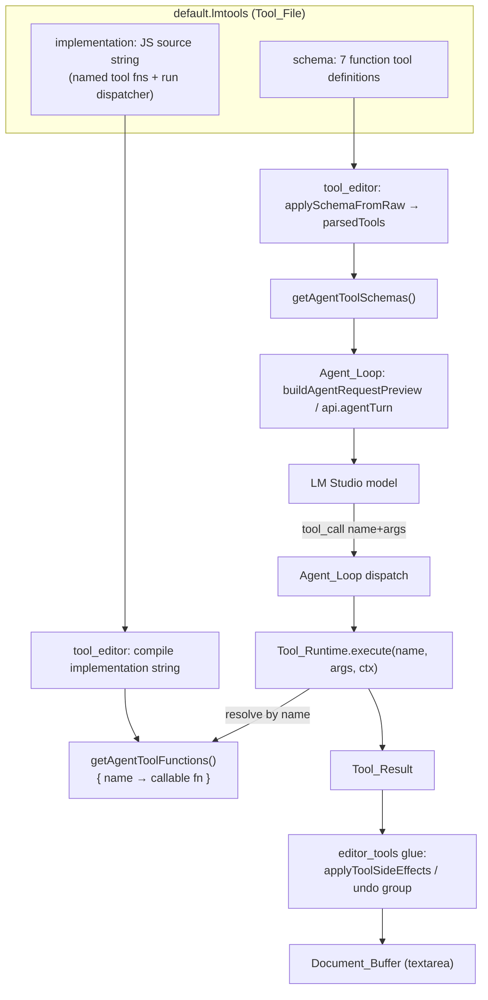

# Design Document

## Overview

Today the seven document tools (`get_document`, `goto_line`, `insert_text`, `replace_line`, `replace_span`, `delete_lines`, `delete_span`) plus the two legacy variants (`replace_range`, `delete_range`) are implemented as compiled-in JavaScript inside the harness `src/editor_tools.js`. The `executeTool(name, args, ctx)` switch dispatches to those functions and builds each `Tool_Result`. The `implementation` field of `default.lmtools` is only a thin stub that forwards every call straight back into `ctx.editorTools.executeTool`.

This feature inverts that relationship. All per-tool logic moves **into** the `implementation` string of `default.lmtools`, so the Implementation_Pane of the Tool_Editor shows the real, runnable tool functions next to their JSON schemas. After extraction:

- `default.lmtools` is the single source of truth for tool behavior. Its `implementation` string defines each tool as a named function plus a `run(args, ctx)` dispatcher.
- `src/editor_tools.js` retains only glue: side-effect application (buffer mutation, caret move, span selection) and the text-geometry utilities those side effects need. It computes no `Tool_Result` and no transformed buffer text.
- The accessor `getAgentTools` is renamed to `getAgentToolSchemas` (the schema array sent to the model), and a new `getAgentToolFunctions` returns the callable tool functions compiled from the loaded implementation.
- The Tool_Runtime resolves a tool's function by name from `getAgentToolFunctions` and executes it; `executeTool` no longer exists as a dispatcher.

This is a behavior-preserving refactor. The agent loop, the document tools' observable results, and the editor side effects must behave exactly as before. The work is validated by a round-trip property (Tool_File save/load) and a model-based equivalence property that compares the extracted implementation's `Tool_Result`s against a frozen copy of the pre-extraction pure functions used as a reference oracle.

### Goals

- Move every per-tool computation out of `src/editor_tools.js` into the `implementation` string of `default.lmtools`.
- Keep `src/editor_tools.js` as harness glue only (side effects + geometry utilities + nothing tool-specific).
- Rename `getAgentTools` → `getAgentToolSchemas`; add `getAgentToolFunctions`.
- Route the Agent_Loop, the chat-apply path, and the tool-call preview through the loaded Tool_File rather than compiled-in logic.
- Preserve identical agent-loop, side-effect, and undo behavior.

### Non-Goals

- Changing tool semantics, schema shape, or the Tool_File JSON format.
- Changing the Tool_Editor's two-pane UI layout or resize behavior.
- Touching the unrelated `.kiro/specs/LLIMEdit` spec.

## Architecture

### Component responsibilities after extraction

| Component | File | Responsibility after extraction |
| --- | --- | --- |
| Default_Tools_File | `default.lmtools` | Holds `implementation` (all tool logic + `run` dispatcher) and `schema` (7 function defs). Single source of truth. |
| Tool_Editor / Tool_Runtime | `src/tool_editor.js` | Loads/saves the Tool_File, validates schema, compiles the implementation, exposes `getAgentToolSchemas` + `getAgentToolFunctions`, and runs a named tool via the runtime. |
| Editor_Tools_Module (glue) | `src/editor_tools.js` | Side-effect application (`applyToolSideEffects`, `applyMutatingResult`, `applyGotoLine`, `applyLineColumnSpan`) + retained Text_Geometry_Utilities. No tool logic. |
| Schema wrapper | `src/editor_tool_schemas.js` | `editorToolDefinitions()` routes to `getAgentToolSchemas`. |
| Agent_Loop | `src/agent.js` | Builds requests from `getAgentToolSchemas`; dispatches tool calls through the runtime; applies results via callbacks/side effects; builds the tool-call preview from the runtime `get_document`. |
| Chat-apply path | `src/editor.js`, `src/chat.js` | Runs assistant-emitted edits through the runtime (now async). |

### Data flow: schema path vs implementation path

The two halves of the Tool_File feed two different consumers. The **schema** is advertised to the model; the **implementation** is compiled into callable functions and executed when a tool is called.



### Sequence: a single mutating tool call in the agent loop

```mermaid
sequenceDiagram
    participant M as Model
    participant A as Agent_Loop (agent.js)
    participant R as Tool_Runtime (tool_editor.js)
    participant F as getAgentToolFunctions
    participant G as editor_tools glue
    participant B as Document_Buffer

    M->>A: tool_call { name: "replace_line", arguments }
    A->>R: get_document preview (runtime) → numbered content
    A->>A: JSON.parse(arguments) (invalid → error Tool_Result)
    A->>R: execute("replace_line", args, ctx)
    R->>F: resolve "replace_line"
    F-->>R: fn (or none → no-implementation result)
    R->>R: fn(args, {...ctx, toolName}) inside try/catch
    R-->>A: Tool_Result { ok, changed, new_text, line, end_line }
    A->>G: applyMutatingResult / applyToolSideEffects
    G->>B: set value = new_text; record on agent undo group
    A->>M: tool message (JSON.stringify(result))
```

### Why the implementation string keeps a `run` entry point

The Tool_Runtime compiles user-authored JavaScript with an `AsyncFunction` whose body ends with `return await run(args, ctx);`. Arbitrary user tool files (and the existing tests) define only `run`. To stay backward-compatible, `run` must remain the universal entry point. The extracted default implementation therefore defines:

1. one named function per tool (`get_document`, `goto_line`, …, plus legacy `replace_range`, `delete_range`),
2. a `tools` registry object literal mapping each name to its function, and
3. an `async function run(args, ctx)` that dispatches on `ctx.toolName` via the registry.

`getAgentToolFunctions` reads the `tools` registry out of the compiled source (falling back to `{ run }` when only `run` is defined), so the runtime can resolve a function by name. This satisfies "implementation is the only source of tool logic" while preserving the `run`-only contract for custom user tools.

## Components and Interfaces

### `src/tool_editor.js` — accessors and runtime

```js
/**
 * Schema_Accessor (rename of getAgentTools).
 * Returns the loaded Tool_Schema array, or [] when nothing is loaded
 * or the current schema is invalid.
 * @returns {Array<{ type: string, function: { name: string, description?: string, parameters?: object } }>}
 */
export function getAgentToolSchemas() { /* returns parsedTools */ }

/**
 * Function_Accessor (new).
 * Compiles the loaded Tool_Implementation and returns a name→function map
 * of callable Document_Tool functions. Returns {} when no implementation
 * is loaded (empty/whitespace). For implementations that define only `run`,
 * returns { run }.
 * @returns {Record<string, (args: object, ctx: object) => (object | Promise<object>)>}
 */
export function getAgentToolFunctions() { /* compile + extract registry */ }

/**
 * Tool_Runtime. Resolves the function for `name` from getAgentToolFunctions
 * and executes it. (Replaces the prior executeCustomTool name/behavior; the
 * old export name MAY be retained as an alias to limit call-site churn.)
 * @returns {Promise<Record<string, unknown>>} a Tool_Result
 */
export async function executeAgentTool(name, args, ctx) { /* see Error Handling */ }
```

Notes:

- `getAgentTools` is **removed**. Any lingering reference throws `ReferenceError` rather than silently returning defaults (Req 3.7). The deprecated `getCustomTools` alias is repointed to `getAgentToolSchemas` or removed.
- `getAgentToolFunctions` compiles the implementation with a **synchronous** `new Function(code + "\n;return (typeof tools !== 'undefined' && tools) ? tools : (typeof run === 'function' ? { run } : {});")`. Compilation only extracts function references; the per-tool functions close over any helpers defined in the string. Compilation is memoized on the exact source string so unsaved Implementation_Pane edits (a new string) trigger recompilation (Req 5.4, 5.5) while repeated calls with unchanged source do not recompile.
- The runtime reads the current Implementation_Pane contents (or `testImplementationOverride` in tests), exactly as `executeCustomTool` does today, so edits take effect before the next execution without saving (Req 5.4, 5.5).

### Runtime resolution algorithm

```
executeAgentTool(name, args, ctx):
  code = current implementation source (impl pane / testImplementationOverride), trimmed
  if code is empty:
      return { ok: false, error: `Tool "${name}" has no implementation in the JS pane.`, changed: false }   // Req 10.1
  try:
      fns = getAgentToolFunctions()                  // compiled registry (memoized)
  catch e:
      return { ok: false, error: `Tool compilation error: ${e.message}`, changed: false }
  fn = fns[name]
  if typeof fn !== "function":
      if typeof fns.run === "function":
          fn = (a, c) => fns.run(a, c)               // run-dispatch fallback (user tools + legacy names)
      else:
          return { ok: false, error: `Tool "${name}" has no available implementation.`, changed: false }  // Req 3.5
  try:
      result = await fn(args, { ...ctx, toolName: name })
      if result == null or typeof result !== "object":
          return { ok: true, result: result ?? "(no return value)", changed: false }
      return result
  catch e:
      return { ok: false, error: `Tool execution error: ${e.message}`, changed: false }   // Req 10.2 / 10.4
```

### `src/editor_tools.js` — retained glue surface

The following exports are **retained** unchanged (side-effect application — Req 2.4, 2.5; Req 7):

```js
export function applyMutatingResult(bufferEl, result) { /* set value to result.new_text */ }
export function applyGotoLine(bufferEl, result) { /* caret to line, col 1 */ }
export function applyLineColumnSpan(bufferEl, line, startColumn, endColumn) { /* select span */ }
export function applyToolSideEffects(bufferEl, name, result) { /* goto_line → caret, else mutate */ }
```

The following Text_Geometry_Utilities are **retained** because the side-effect helpers reach them directly or transitively (Req 2.6, 2.7):

```js
export function splitLines(value) { /* used by applyLineColumnSpan, lineColumnToIndex */ }
function clampLine(line, totalLines) { /* used by applyLineColumnSpan, lineColumnToIndex */ }
function normalizeColumn(column) { /* used by resolveSpanColumns, lineColumnToIndex */ }
export function resolveSpanColumns(lineText, startColumn, endColumn) { /* used by applyLineColumnSpan */ }
export function lineColumnToIndex(text, line, column) { /* used by applyGotoLine */ }
```

The following are **removed** from `src/editor_tools.js` (their logic moves into the `implementation` string):

- `getDocumentSnapshot`, `gotoLine`, `insertText`, `replaceLine`, `replaceSpan`, `deleteSpan`, `deleteLines`, `replaceRange`, `deleteRange`
- `executeTool` (the switch dispatcher)
- the `withChanged` helper
- the `import { refreshContextWindow } from "./context_window.js"` (the implementation receives windowing through `ctx`, see below)
- `joinLines` — used only by tool logic (no side-effect helper reaches it), so it moves into the implementation string and is dropped from the harness (Req 2.2; Req 2.6/2.7 require retaining only geometry the glue uses).

> Decision: there is intentional duplication of small geometry helpers. The harness keeps the copies its side effects need; the implementation string carries its own copies (it cannot `import` the harness, and the harness must not call into the sandboxed string). This duplication is required by the extraction boundary and is acceptable for two ~5-line helpers.

### `src/editor_tool_schemas.js`

```js
import { getAgentToolSchemas } from "./tool_editor.js";
/** @returns {Array<{ type: string, function: object }>} */
export function editorToolDefinitions() {
  return getAgentToolSchemas();   // Req 3.6
}
```

### `src/agent.js` — Agent_Loop call sites

- Replace both `getAgentTools()` calls (initial request + per-turn request) with `getAgentToolSchemas()` (Req 3.3, 5.6).
- Replace the dispatch:
  - `parseError` → `{ ok: false, error: "invalid tool arguments JSON", changed: false }` (unchanged, Req 6.5).
  - `else if (isSchemaTool(name))` → `result = await executeAgentTool(name, parsedArgs, execCtx)` (Req 6.1).
  - `else` → `{ ok: false, error: \`Unknown tool: ${name}\`, changed: false }` (Req 6.4).
  - `isSchemaTool(name)` = membership in `getAgentToolSchemas()` names (the renamed/adjusted `isUserCustomTool`). The model only ever sees schema tools, so this preserves unknown-tool detection. Legacy `replace_range`/`delete_range` are not advertised in the schema and so are not invoked from the loop; they remain runnable through the runtime registry on the chat-apply path (Req 1.2).
- `execCtx` adds `refreshWindow` so the implementation's `get_document` can compute the same context window the harness used to:
  ```js
  const execCtx = { ...ctx, toolName: toolCall.name, refreshWindow: refreshContextWindow };
  ```
- **Tool-call preview (Req 6.6):** replace `editorTools.getDocumentSnapshot(...)` with a runtime `get_document` call and map its result fields into the `documentView`:
  ```js
  const snap = await executeAgentTool("get_document", {}, { ...ctx, refreshWindow: refreshContextWindow });
  callbacks.onToolCall?.(toolCall, {
    numbered: snap.content, path: snap.path, lines: snap.lines,
    is_truncated: snap.is_truncated,
    window_start_line: snap.window_start_line, window_end_line: snap.window_end_line,
  });
  ```
  If the loaded Tool_File lacks `get_document` (exotic custom file), the preview falls back to the raw buffer text with no renumbering — a display-only concern that does not reconstruct tool logic in the harness. The default tools always include `get_document`, so the normal path always renders numbered content.

### Chat-apply path — `src/editor.js` + `src/chat.js`

`applyDocumentEdits` runs assistant-emitted edits through the runtime (Req 9.2). Because the runtime is async, `applyDocumentEdits` becomes async:

```js
export async function applyDocumentEdits(edits) {           // now async
  if (!bufferEl || !Array.isArray(edits) || edits.length === 0) return 0;
  if (agentActive || streamActive) return 0;
  _beginAgentEdit();
  let applied = 0;
  try {
    for (const edit of edits) {
      if (!edit || typeof edit.name !== "string") continue;
      const ctx = { text: bufferEl.value, path: currentPath, refreshWindow };
      const result = await executeAgentTool(edit.name, edit.args ?? {}, ctx);  // Req 9.2, 9.3
      _applyAgentToolResult(bufferEl, edit.name, result);
      if (result.ok === true && result.changed === true) applied += 1;
    }
  } finally { _completeAgentEdit(); }
  return applied;
}

export async function applyDocumentEditsFromAssistantText(assistantText) {  // now async
  return applyDocumentEdits(extractDocumentEdits(assistantText));
}
```

`src/chat.js` apply button handler awaits the promise before updating the label:

```js
btn.addEventListener("click", async () => {
  const applied = await editor.applyDocumentEdits(edits);
  btn.textContent = applied > 0 ? "Applied" : "No changes applied";
  if (applied > 0) btn.disabled = true;
});
```

> Decision: async over a parallel synchronous path. The Tool_Runtime compiles with `AsyncFunction` and a user may rewrite a default tool to be async; forcing a synchronous chat-apply path would create a second execution path that could diverge from the loop's path and break the equivalence guarantees (Req 8.2). A single async runtime is the only path that keeps loop and chat-apply behavior identical. `_applyAgentToolResult` stays synchronous and runs after each awaited result, so the agent undo group still records one reversible change per edit (Req 7.4).

### Implementation-string code contract (the `implementation` field of `default.lmtools`)

The string is plain JavaScript (no imports) with this structure, readable as a learning artifact:

```js
// ── geometry helpers (self-contained; cannot import the harness) ──
function splitLines(value) { /* "" → [""]; else value.split("\n") */ }
function joinLines(lines) { return lines.join("\n"); }
function clampLine(line, totalLines) { /* clamp to 1..max(1,totalLines) */ }   // Req 10.3
function normalizeColumn(column) { /* max(1, trunc) */ }
function resolveSpanColumns(lineText, startColumn, endColumn) { /* …same as harness… */ }

// ── per-tool functions: each returns a Tool_Result ──
function get_document(args, ctx) {
  const text = typeof ctx.text === "string" ? ctx.text : "";
  const path = (typeof ctx.path === "string" && ctx.path.length > 0) ? ctx.path : null;
  const anchor = ctx.contextAnchor ?? null;
  if (anchor && typeof anchor === "object" && typeof ctx.refreshWindow === "function") {
    const w = ctx.refreshWindow(text, anchor);
    return { ok: true, lines: w.total_lines, path, content: w.numbered,
             is_truncated: w.is_truncated,
             window_start_line: w.window_start_line, window_end_line: w.window_end_line,
             changed: false };
  }
  const lines = splitLines(text);
  const numbered = lines.map((l, i) => `${i + 1}| ${l}`).join("\n");
  return { ok: true, lines: lines.length, path, content: numbered,
           is_truncated: false, window_start_line: 1, window_end_line: lines.length,
           changed: false };
}
function goto_line(args, ctx) { /* clampLine; returns { ok, line, column:1, line_text } */ }
function insert_text(args, ctx) { /* returns { ok, line, column, new_text, changed } */ }
function replace_line(args, ctx) { /* { ok, line, end_line, new_text, changed } */ }
function replace_span(args, ctx) { /* { ok, line, start_column, end_column, effective_*, new_text, changed } */ }
function delete_lines(args, ctx) { /* { ok, start_line, end_line, deleted_lines, new_text, changed } */ }
function delete_span(args, ctx) { /* delegates to replace_span with "" */ }
function replace_range(args, ctx) { /* legacy; single-line → replace_line semantics */ }
function delete_range(args, ctx) { /* legacy; delegates to delete_lines */ }

// ── changed-flag helper (was harness withChanged) ──
function withChanged(result, originalText) {
  if (!result || result.ok !== true || typeof result.new_text !== "string") {
    return { ...result, changed: false };
  }
  return { ...result, changed: result.new_text !== originalText };
}

// ── registry + dispatcher ──
const tools = { get_document, goto_line, insert_text, replace_line, replace_span,
                delete_lines, delete_span, replace_range, delete_range };

async function run(args, ctx) {
  const fn = tools[ctx.toolName];
  if (typeof fn !== "function") {
    return { ok: false, error: `Tool "${ctx.toolName}" has no implementation.`, changed: false };
  }
  return fn(args, ctx);
}
```

Contract summary:

- Each tool reads its inputs from `args` and the buffer text from `ctx.text` (the runtime passes the live buffer text into `ctx`, exactly as `executeTool` received `ctx.text` today).
- Mutating tools return `new_text` and a `changed` flag computed against `ctx.text` via `withChanged`. Read-only tools (`get_document`, `goto_line`) return `changed: false` / no `new_text`.
- `get_document` obtains its context window through `ctx.refreshWindow` (a reference to `refreshContextWindow` supplied by the harness) and `ctx.contextAnchor`; when no anchor is provided it falls back to simple 1-based numbering — identical to the pre-extraction `getDocumentSnapshot` behavior.
- `run` stays the entry point so the existing `AsyncFunction(..., code + "\nreturn await run(args, ctx);")` invocation continues to work for any caller.

## Data Models

### Tool_File

```jsonc
{
  "version": 1,
  "implementation": "<JS source string: tool fns + tools registry + run()>",
  "schema": [ /* exactly 7 FunctionToolDefinition entries (Req 1.3) */ ]
}
```

`parseToolFileContents(raw)` continues to return `{ implementation: string, schema: string }`; `serializeToolFile()` continues to emit `{ version, implementation, schema }` with `schema` parsed back to JSON. These are unchanged (the round-trip property, Req 8.1, depends on them staying stable).

### FunctionToolDefinition (schema entry)

```jsonc
{ "type": "function",
  "function": { "name": "string", "description": "string", "parameters": { /* JSON Schema */ } } }
```

### Tool_Result

Common fields: `ok: boolean`, `changed: boolean` (mutating tools), optional `new_text: string` (mutating tools), optional `error: string` (failures). Per-tool metadata mirrors the current `executeTool` output exactly:

| Tool | Result fields (in addition to `ok`) |
| --- | --- |
| `get_document` | `lines`, `path`, `content`, `is_truncated`, `window_start_line`, `window_end_line`, `changed:false` |
| `goto_line` | `line`, `column`, `line_text` |
| `insert_text` | `line`, `column`, `new_text`, `changed` |
| `replace_line` | `line`, `end_line`, `new_text`, `changed` |
| `replace_span` | `line`, `start_column`, `end_column`, `effective_start_column`, `effective_end_column`, `new_text`, `changed` |
| `delete_span` | `line`, `start_column`, `end_column`, `effective_start_column`, `effective_end_column`, `new_text`, `changed` |
| `delete_lines` | `start_line`, `end_line`, `deleted_lines`, `new_text`, `changed` |
| `replace_range` (legacy) | `line`, `start_line`, `end_line`, `new_text`, `changed` |
| `delete_range` (legacy) | `start_line`, `end_line`, `deleted_lines`, `new_text`, `changed` |
| failure (any) | `error`, `changed:false` |

### Execution context (`ctx`) passed to the runtime

```js
{
  text: string,                 // live Document_Buffer content
  path: string | null,
  contextAnchor: object | null, // sliding-window anchor (agent loop only)
  refreshWindow: (text, anchor) => Window,  // reference to refreshContextWindow
  toolName: string              // injected by the runtime before calling the fn
}
```

This is the resolution of the windowing dependency: `get_document`'s logic stays in the implementation string, but the windowing primitive (`refreshContextWindow` from `context_window.js`) is injected through `ctx.refreshWindow` rather than imported. The harness owns the import; the sandboxed string owns the `Tool_Result` assembly.

## Correctness Properties

*A property is a characteristic or behavior that should hold true across all valid executions of a system — essentially, a formal statement about what the system should do. Properties serve as the bridge between human-readable specifications and machine-verifiable correctness guarantees.*

This feature is a strong fit for property-based testing: the document tools are pure functions over `(buffer, args)`, the Tool_File parse/serialize pair is a serializer, and the side-effect helpers are deterministic transformations over `(buffer, result)`. Requirement 8 already states five properties explicitly. The prework consolidated overlapping criteria into the nine non-redundant properties below.

### Property 1: Tool_File save/load round-trip

*For any* Tool_File contents produced by the Tool_Editor (any implementation string and any schema array of function definitions), serializing the file and then parsing it again yields an implementation string character-for-character identical to the original and a schema deep-structurally equal to the original, with tool definitions in the same order and the same fields and values.

**Validates: Requirements 8.1, 1.6, 5.3**

### Property 2: Model-based equivalence with the pre-extraction oracle

*For any* Document_Tool name (the seven schema tools plus legacy `replace_range`/`delete_range`), *any* Document_Buffer content, and *any* arguments conforming to that tool's schema (including out-of-range line/column values), the Tool_Result produced by the extracted Tool_Implementation run through the Tool_Runtime is deep-equal — `ok`, `changed`, `new_text`, and every tool-specific metadata field — to the Tool_Result produced by the frozen pre-extraction `editor_tools.executeTool` reference oracle for the same buffer and arguments.

**Validates: Requirements 8.2, 1.4, 1.5, 2.1, 10.3**

### Property 3: Side-effect application correctness

*For any* Tool_Result and Document_Buffer: if the result has `ok === true`, `changed === true`, and a string `new_text`, applying it sets the buffer content character-for-character equal to `new_text`; if the result's `changed` flag is not true (or `ok` is not true, or `new_text` is absent/non-string), applying it leaves the buffer content unchanged.

**Validates: Requirements 6.2, 6.3, 7.1, 7.5, 7.6, 8.3**

### Property 4: goto_line caret placement

*For any* Document_Buffer and *any* `goto_line` Tool_Result with `ok === true`, applying the result places the caret at the first character (column 1) of the reported 1-based line with no text selected (`selectionStart === selectionEnd`).

**Validates: Requirements 7.2**

### Property 5: span selection bounds

*For any* Document_Buffer and *any* `replace_span`/`delete_span` Tool_Result with `ok === true`, applying the result selects the text on the reported line from the 1-based inclusive `start_column` through the 1-based inclusive `end_column`, extending the selection to end-of-line when `end_column` exceeds the line length.

**Validates: Requirements 7.3**

### Property 6: agent-edit undo round-trip

*For any* Document_Buffer and *any* mutating Tool_Result applied during an agent edit, a single undo operation restores the buffer to its exact content immediately before the result was applied.

**Validates: Requirements 7.4**

### Property 7: get_document is read-only

*For any* Document_Buffer content, executing `get_document` through the Tool_Runtime leaves the buffer content unchanged and returns a Tool_Result whose `changed` flag is false.

**Validates: Requirements 8.4**

### Property 8: goto_line line bounds

*For any* Document_Buffer content and *any* `goto_line` arguments carrying an integer line value (including values below 1 or above the line count), the line number reported in the Tool_Result is within the inclusive range 1 to the maximum of 1 and the buffer's line count.

**Validates: Requirements 8.5, 10.3**

### Property 9: schema validation status reflects tool definitions

*For any* array of function tool definitions: when all entries are valid and have names unique among the array (N ≥ 1 entries), `applySchemaFromRaw` reports a count of N and marks the schema valid; when the array contains at least one duplicated tool name, it reports an error identifying the duplicate name(s) and clears the parsed tool set.

**Validates: Requirements 4.5, 4.8**

## Error Handling

| Condition | Where handled | Tool_Result / behavior | Requirement |
| --- | --- | --- | --- |
| Implementation absent/null/whitespace | Tool_Runtime (`executeAgentTool`) | `{ ok:false, error:"…has no implementation in the JS pane.", changed:false }`; buffer unchanged | 10.1 |
| Implementation throws during execution | Tool_Runtime try/catch | `{ ok:false, error:"Tool execution error: …", changed:false }`; buffer unchanged | 10.2, 10.4 |
| No function resolved for the requested name | Tool_Runtime (after registry lookup + `run` fallback) | `{ ok:false, error:"Tool \"<name>\" has no available implementation.", changed:false }` | 3.5 |
| Line argument out of range | Tool_Implementation (`clampLine`) | line clamped to `1..max(1, lineCount)` before computing the result | 10.3, 3 (geometry) |
| Model requests a tool absent from the schema | Agent_Loop dispatch `else` branch | `{ ok:false, error:"Unknown tool: <name>", changed:false }`; buffer unchanged | 6.4 |
| Tool-call arguments are not valid JSON | Agent_Loop (`JSON.parse` catch) | `{ ok:false, error:"invalid tool arguments JSON", changed:false }`; buffer unchanged | 6.5 |
| Chat edit names absent tool / invalid args | Chat-apply path via runtime | runtime returns failure result; `_applyAgentToolResult` no-ops; `applied` count unchanged; button shows "No changes applied" | 9.3 |
| Schema_Pane holds invalid JSON | `applySchemaFromRaw` catch | error status shown; retain most recently valid tool definitions for execution/requests | 4.7, 5.8 |
| Schema_Pane holds invalid def / duplicate names | `applySchemaFromRaw` validation | error status identifying invalid/duplicate names; parsed tool set cleared | 4.8 |
| Failing Tool_Result applied to buffer | Side-effect helpers (`ok !== true` guard) | buffer, caret, and selection unchanged | 7.5, 7.6 |

Retention behavior for Req 5.8 is a change from today: `applySchemaFromRaw` currently clears `parsedTools` on invalid input. The runtime/request path must keep the last valid schema and implementation so an in-progress invalid edit does not strip the model's tools. This is implemented by tracking `lastValidParsedTools` and having `getAgentToolSchemas` return it when the current buffer is invalid, while the status display still reflects the current (invalid) content per Req 4.7.

## Testing Strategy

### Dual approach

- **Property-based tests** verify the nine universal properties above across generated inputs.
- **Unit / integration / example tests** cover specific behaviors, wiring, edge cases, and error conditions (Reqs 4, 5, 6, 7, 9, 10) that are not universal properties.

### Property-based testing setup

- **Library:** `fast-check` with Vitest (the project already uses Vitest). Do not hand-roll generators or iteration.
- **Iterations:** configure each property test for **minimum 100 runs** (`fc.assert(prop, { numRuns: 100 })` or higher).
- **Tagging:** each property test carries a comment in the form
  `// Feature: extract-tools-to-lmtools, Property <n>: <property text>`
  and references the design property it implements.
- **Generators:**
  - Document buffers: `fc.string()` plus a multi-line generator (`fc.array(fc.string()).map(a => a.join("\n"))`) including empty strings, all-whitespace lines, and trailing newlines.
  - Line arguments: `fc.integer()` spanning below-1, in-range, and above-count to exercise clamping/bounds.
  - Column/span arguments: `fc.integer({ min: -2 })` to cross EOL boundaries.
  - Schema arrays (Property 9): generate N unique-named function defs and variants that inject a duplicate name.
  - Tool_File contents (Property 1): generate arbitrary implementation strings and schema arrays of function defs.

### Model-based equivalence harness (Property 2)

The reference oracle is the **pre-extraction pure functions**. Concretely:

1. Snapshot the current `src/editor_tools.js` tool logic — `executeTool` and the per-tool functions it calls — into a **test-only frozen reference module**, e.g. `src/__tests__/oracles/editor_tools_reference.js`, captured *before* the harness is gutted. This file is never modified again and is excluded from production imports.
2. The property generates `(name, buffer, args)` where `args` conform to the named tool's schema (and deliberately include out-of-range values), then compares:
   - `actual = await executeAgentTool(name, args, { text: buffer, path, contextAnchor, refreshWindow })` (extracted implementation via runtime), against
   - `expected = referenceModule.executeTool(name, args, { text: buffer, path, contextAnchor })` (frozen oracle).
3. Assert deep equality of `ok`, `changed`, `new_text`, and all tool-specific metadata fields.
4. `get_document` is compared with a `contextAnchor` supplied and `refreshWindow = refreshContextWindow` so both paths produce identical windowed `content`.

This makes the refactor provably behavior-preserving: any divergence between the extracted implementation and the original logic fails the property with a minimal counterexample.

### Requirements coverage map

| Requirement(s) | Test type | Coverage |
| --- | --- | --- |
| 1.1, 1.2 | Example | Invoke each of the 7 + 2 legacy names through the runtime against the loaded default file; assert Tool_Result shape. |
| 1.3, 1.6, 9.1 | Example | Parse `default.lmtools`/fixture; assert one implementation string and a schema of exactly 7 named defs. |
| 1.4, 1.5, 2.1, 10.3 | **Property 2** | Model-based equivalence vs frozen oracle. |
| 2.2 | Example | `import * as editorTools`; assert `executeTool`/`get_document`/`gotoLine`/`insertText`/`replaceLine`/`replaceSpan`/`deleteSpan`/`deleteLines`/`replaceRange`/`deleteRange` are all `undefined`. |
| 2.3 | Example | Agent-loop dispatch calls `executeAgentTool`; harness exposes no dispatcher. |
| 2.4, 2.5, 2.6, 2.7 | Example + properties | Assert side-effect helpers + geometry utilities still exported; behavior covered by Properties 3–5. |
| 3.1 | Example | After fixture load → 7 schemas; after `resetForTests` → `[]`. |
| 3.2 | Example | After load → each name resolves to a function; after reset → empty map. |
| 3.3, 5.6 | Example | Stub `api.agentTurn`; assert request tools equal `getAgentToolSchemas()` (including after a schema edit). |
| 3.4, 5.5 | Example | Override implementation with a sentinel function; invoke by name; assert the override ran. |
| 3.5 | Edge case | Implementation lacking a name → no-implementation result, `changed:false`. |
| 3.6 | Example | `editorToolDefinitions()` returns schemas; agent.js references `getAgentToolSchemas`. |
| 3.7 | Example | Assert `getAgentTools` is no longer exported (import is `undefined`). |
| 4.1, 4.2, 4.3 | Example | Load default file in mounted DOM; assert panes populated and impl pane is left of schema pane. |
| 4.4 | Example | Change schema content; assert status updates. |
| 4.5, 4.8 | **Property 9** | Schema validation status over generated tool arrays (count vs duplicate error). |
| 4.6, 4.7 | Edge case | `""`/`[]` → count 0; malformed JSON → error status. |
| 5.1, 5.2 | Example | Edit panes; assert dirty + revalidation. |
| 5.3 | Example | Serialize then parse panes; assert fields. (General case = Property 1.) |
| 5.4 | Example | Edit schema then call `getAgentToolSchemas`; assert new content used without save. |
| 5.7 | Example | Drive a tool result through `applyToolSideEffects`; assert buffer updated. (General = Property 3.) |
| 5.8 | Edge case | After a valid load, set invalid schema; assert `getAgentToolSchemas` returns the last valid set. |
| 6.1 | Example/integration | Stub model returning multiple tool calls; assert results produced in order. |
| 6.2, 6.3 | **Property 3** | Side-effect application correctness. |
| 6.4 | Edge case | Unknown tool name in loop → Unknown-tool result, buffer unchanged. |
| 6.5 | Edge case | Malformed arguments → invalid-args result, buffer unchanged. |
| 6.6 | Example | Drive a tool call; assert `onToolCall` documentView is 1-based numbered current buffer. |
| 7.1 | **Property 3** | Mutation invariant. |
| 7.2 | **Property 4** | goto_line caret placement. |
| 7.3 | **Property 5** | Span selection bounds. |
| 7.4 | **Property 6** | Agent-edit undo round-trip. |
| 7.5, 7.6 | **Property 3** + edge case | Failing/`new_text`-less results leave buffer unchanged. |
| 8.1 | **Property 1** | File round-trip. |
| 8.2 | **Property 2** | Model-based equivalence. |
| 8.3 | **Property 3** | Mutation invariant. |
| 8.4 | **Property 7** | get_document read-only. |
| 8.5 | **Property 8** | goto_line bounds. |
| 9.2 | Example/integration | Click apply button (await async); assert buffer updated through the runtime. |
| 9.3 | Edge case | Chat edit with unknown name / bad args → buffer unchanged, applied count 0, "No changes applied". |
| 9.4 | Smoke | Full Vitest suite green after extraction. |
| 9.5 | Example | `default_lmtools.test.js` asserts the implementation defines tool logic directly and contains no `editorTools.executeTool` forwarding call. |
| 10.1 | Edge case | Empty implementation → no-implementation result, `changed:false`, buffer unchanged. |
| 10.2, 10.4 | Edge case | Implementation whose `run` throws (incl. post-clamp) → execution-error result, `changed:false`, buffer unchanged. |
| 10.3 | **Property 2** + **Property 8** | Clamping verified by equivalence + bounds. |

### Test fixture and existing-test updates

- `src/__tests__/setup/default_lmtools_fixture.js`: unchanged in mechanism (parse `default.lmtools`, `setLoadedToolsForTests`), but now loads the extracted implementation; it must supply one implementation defining the tool logic and a schema of the seven defs (Req 9.1).
- `src/__tests__/default_lmtools.test.js`: flip the assertion from `expect(parsed.implementation).toContain("editorTools.executeTool")` to assertions that the implementation defines the tool functions (e.g. contains `function run` and per-tool names) and **does not** contain `editorTools.executeTool` (Req 9.5). Replace `getAgentTools` import with `getAgentToolSchemas`.
- `src/__tests__/editor_tools.test.js`: remove tests for the removed pure functions/`executeTool`; retain tests for `splitLines`, `joinLines` (if kept) , `resolveSpanColumns`, `lineColumnToIndex`, `applyLineColumnSpan` and the retained side-effect helpers. Equivalence of removed behavior is now guaranteed by Property 2 against the frozen oracle.
- `src/__tests__/chat_apply_edits.test.js`: update the click handler expectation to await the async apply (e.g. `await btn.click()`-style flush / `await vi.waitFor(() => expect(buffer.value).toContain("build-up"))`), since `applyDocumentEdits` is now async (Req 9.2).
- `src/__tests__/oracles/editor_tools_reference.js` (new): frozen copy of the pre-extraction tool logic used only by the Property 2 harness.

### Verification gate

After implementation, run the full Vitest suite (`npm test -- --run`) and confirm zero failing cases (Req 9.4), including the new property tests at ≥100 iterations each.

## Requirements Mapping

| Requirement | Design coverage |
| --- | --- |
| **1** Tool implementations reside in the Tool File | Implementation-string code contract; `tools` registry + `run` dispatcher; schema of 7 retained; legacy variants in registry. |
| **2** Editor_Tools_Module contains no tool logic | "Removed from `src/editor_tools.js`" list; retained glue surface; geometry duplication decision. |
| **3** Renamed accessors | `getAgentToolSchemas`, `getAgentToolFunctions`, runtime resolution algorithm, `editor_tool_schemas.js` rewire, removal of `getAgentTools`. |
| **4** Two-pane display | `applyToolFileContents` populates panes (unchanged layout); `applySchemaFromRaw` status (Property 9, edge cases). |
| **5** Editing and testing tools | Runtime reads current pane contents; memoized recompile on source change; `getAgentToolSchemas` from current schema; Req 5.8 retention via `lastValidParsedTools`. |
| **6** Agent loop behavior preserved | agent.js dispatch changes; ordered execution; unknown-tool/invalid-args handling; runtime-backed preview (6.6). |
| **7** Editor side effects preserved | Retained side-effect helpers; Properties 3–6; failing-result guards. |
| **8** Round-trip and equivalence | Properties 1, 2, 3, 7, 8; model-based equivalence harness with frozen oracle. |
| **9** Test fixtures and chat-edit path | Async chat-apply path (editor.js + chat.js); fixture/test updates; frozen oracle module; suite green gate. |
| **10** Tool runtime error handling | Error Handling table; runtime try/catch; clamping in implementation; Properties 2 + 8 for clamping. |
