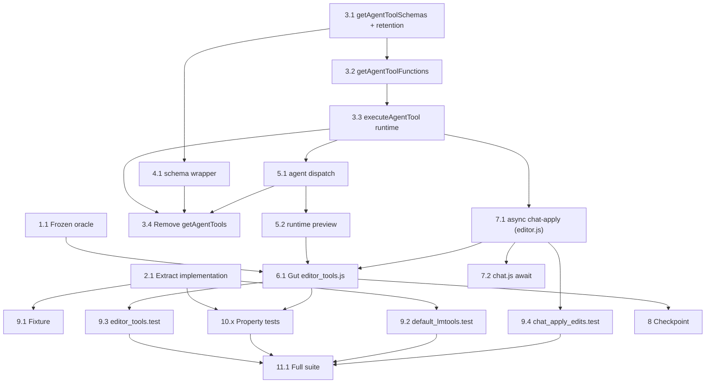

# Implementation Plan: Extract Tools to default.lmtools

## Overview

This plan extracts all per-tool logic out of the `src/editor_tools.js` harness and into the
`implementation` string of `default.lmtools`, renames/repoints the tool accessors, rewires the
agent loop and chat-apply path through the new async Tool_Runtime, and validates the refactor with
property-based tests plus a model-based equivalence harness.

The sequence is deliberately ordered: **capture the frozen reference oracle before the harness is
gutted** (otherwise the original logic is lost), then add the new implementation and runtime,
rewire every call site, gut the harness, and only then update tests. Implementation language is
JavaScript (matches the existing codebase and the design's code contract).

## Tasks

- [x] 1. Capture the frozen pre-extraction reference oracle (test-only)
  - [x] 1.1 Create `src/__tests__/oracles/editor_tools_reference.js` as a verbatim, frozen copy of the current pre-extraction tool logic
    - Copy, unchanged, the current `executeTool` switch dispatcher plus every per-tool pure function it calls (`getDocumentSnapshot`, `gotoLine`, `insertText`, `replaceLine`, `replaceSpan`, `deleteSpan`, `deleteLines`, `replaceRange`, `deleteRange`) and their helpers (`splitLines`, `joinLines`, `clampLine`, `normalizeColumn`, `resolveSpanColumns`, `withChanged`)
    - Keep the `import { refreshContextWindow } from "../../context_window.js"` so the oracle's `get_document` produces identical windowed content
    - Add a header comment marking the file as a frozen reference oracle that must never be modified and is excluded from production imports
    - This MUST be created BEFORE Task 6 guts the harness, while the original logic still exists
    - _Requirements: 8.2_

- [x] 2. Extract the tool implementations into the Tool_File
  - [x] 2.1 Write the self-contained `implementation` string in `default.lmtools`
    - Add geometry helpers `splitLines`, `joinLines`, `clampLine`, `normalizeColumn`, `resolveSpanColumns` (own copies — the string cannot import the harness)
    - Add per-tool functions `get_document`, `goto_line`, `insert_text`, `replace_line`, `replace_span`, `delete_lines`, `delete_span` plus legacy `replace_range`, `delete_range`, each returning the exact `Tool_Result` shape in the design's Data Models table
    - `get_document` reads `ctx.text`, and when `ctx.contextAnchor` is present and `ctx.refreshWindow` is a function uses them for windowed numbered content; otherwise falls back to simple 1-based numbering
    - Add the `withChanged(result, originalText)` helper that sets `changed` against `ctx.text`; clamp line args to `1..max(1, lineCount)` for bounds (Req 10.3)
    - Add a `tools` registry object literal mapping each name to its function and an `async function run(args, ctx)` that dispatches on `ctx.toolName` via the registry
    - Leave the seven `schema` entries unchanged
    - _Requirements: 1.1, 1.2, 1.3, 1.4, 1.5, 1.6, 10.3_

- [x] 3. Add Tool_Editor accessors and the Tool_Runtime (`src/tool_editor.js`)
  - [x] 3.1 Rename `getAgentTools` → `getAgentToolSchemas` and add last-valid retention
    - Rename the export to `getAgentToolSchemas`; it returns the loaded Tool_Schema array, `[]` when nothing is loaded
    - Track `lastValidParsedTools` and return it from `getAgentToolSchemas` when the current schema buffer is invalid, so an in-progress invalid edit does not strip the model's tools (status display still reflects the current invalid content)
    - _Requirements: 3.1, 5.8_
  - [x] 3.2 Add `getAgentToolFunctions`
    - Compile the current Implementation_Pane source (or `testImplementationOverride`) with a synchronous `new Function(code + "\n;return (typeof tools !== 'undefined' && tools) ? tools : (typeof run === 'function' ? { run } : {});")`
    - Return the name→function registry; return `{ run }` for run-only implementations and `{}` for empty/whitespace implementations
    - Memoize compilation on the exact source string so unsaved edits recompile but unchanged source does not
    - _Requirements: 3.2, 5.4, 5.5_
  - [x] 3.3 Add the `executeAgentTool(name, args, ctx)` runtime (repoint/rename `executeCustomTool`)
    - Implement the design's resolution algorithm: empty implementation → no-implementation result; resolve `fn` from `getAgentToolFunctions()`; fall back to a `run`-dispatch wrapper when the name is absent but `run` exists; otherwise return a no-available-implementation result with `changed:false`
    - Run `fn(args, { ...ctx, toolName: name })` inside try/catch; non-object returns wrap as `{ ok:true, result, changed:false }`; thrown errors return `{ ok:false, error:"Tool execution error: …", changed:false }`
    - _Requirements: 3.4, 3.5, 10.1, 10.2, 10.4_
  - [x] 3.4 Remove `getAgentTools` entirely and repoint remaining aliases
    - Delete the `getAgentTools` export so any lingering reference throws `ReferenceError` (no silent default tools)
    - Repoint or remove the deprecated `getCustomTools` alias to `getAgentToolSchemas`; ensure the schema-membership check (renamed from `isUserCustomTool`/`isSchemaTool`) reads names from `getAgentToolSchemas()`
    - _Requirements: 3.7, 6.4_
  - [x]* 3.5 Write unit tests for the accessors and runtime error handling
    - Cover: no-implementation result (Req 10.1), execution-error result (Req 10.2/10.4), missing-name no-available-implementation result (Req 3.5), `getAgentToolFunctions` empty vs populated (Req 3.2), and last-valid retention when schema becomes invalid (Req 5.8)
    - _Requirements: 3.2, 3.5, 5.8, 10.1, 10.2, 10.4_

- [x] 4. Rewire the schema wrapper (`src/editor_tool_schemas.js`)
  - [x] 4.1 Repoint `editorToolDefinitions()` to `getAgentToolSchemas`
    - Replace the `getAgentTools` import and call with `getAgentToolSchemas`
    - _Requirements: 3.6_

- [x] 5. Rewire the Agent_Loop (`src/agent.js`)
  - [x] 5.1 Replace the schema accessor and tool dispatch
    - Swap both `getAgentTools()` calls (initial request + per-turn request) for `getAgentToolSchemas()`
    - Dispatch: invalid-args → `{ ok:false, error:"invalid tool arguments JSON", changed:false }`; schema tool → `result = await executeAgentTool(name, parsedArgs, execCtx)`; otherwise → `{ ok:false, error:"Unknown tool: <name>", changed:false }`, using schema-name membership for the check
    - Build `execCtx = { ...ctx, toolName: toolCall.name, refreshWindow: refreshContextWindow }`; preserve ordered execution and `mutatingToolCount` accounting
    - _Requirements: 6.1, 6.2, 6.3, 6.4, 6.5, 3.3, 5.5, 5.6_
  - [x] 5.2 Replace the tool-call preview with a runtime `get_document`
    - Replace `editorTools.getDocumentSnapshot(...)` with `await executeAgentTool("get_document", {}, { ...ctx, refreshWindow: refreshContextWindow })` and map `content/path/lines/is_truncated/window_start_line/window_end_line` into the `documentView`
    - Fall back to raw buffer text with no renumbering when the loaded Tool_File lacks `get_document`
    - _Requirements: 6.6_
  - [x]* 5.3 Write agent-loop integration/edge tests
    - Multiple tool calls applied in order (Req 6.1); unknown-tool name leaves buffer unchanged (Req 6.4); malformed arguments leave buffer unchanged (Req 6.5); `onToolCall` documentView is 1-based numbered current buffer (Req 6.6)
    - _Requirements: 6.1, 6.4, 6.5, 6.6_

- [x] 6. Gut `src/editor_tools.js` down to harness glue
  - [x] 6.1 Remove all per-tool logic and keep only glue + geometry
    - Remove `getDocumentSnapshot`, `gotoLine`, `insertText`, `replaceLine`, `replaceSpan`, `deleteSpan`, `deleteLines`, `replaceRange`, `deleteRange`, `executeTool`, the `withChanged` helper, `joinLines`, and the `import { refreshContextWindow } from "./context_window.js"`
    - Retain `applyMutatingResult`, `applyGotoLine`, `applyLineColumnSpan`, `applyToolSideEffects`, and the Text_Geometry_Utilities `splitLines`, `clampLine`, `normalizeColumn`, `resolveSpanColumns`, `lineColumnToIndex`
    - Must run AFTER Task 1 (oracle captured) and after Tasks 5 and 7 stop calling `editorTools.executeTool`/`getDocumentSnapshot`
    - _Requirements: 2.1, 2.2, 2.3, 2.4, 2.5, 2.6, 2.7_

- [x] 7. Make the chat-apply path async through the runtime
  - [x] 7.1 Convert `applyDocumentEdits`/`applyDocumentEditsFromAssistantText` to async in `src/editor.js`
    - Make both functions `async`; route each edit through `await executeAgentTool(edit.name, edit.args ?? {}, { text: bufferEl.value, path: currentPath, refreshWindow })`
    - Keep `_applyAgentToolResult` synchronous and call it after each awaited result so the agent undo group still records one reversible change per edit; count edits where `ok === true && changed === true`
    - _Requirements: 7.4, 9.2, 9.3_
  - [x] 7.2 Update the apply-button click handler in `src/chat.js` to await
    - Make the handler `async` and `await editor.applyDocumentEdits(edits)` before setting the label ("Applied" / "No changes applied") and disabling on success
    - _Requirements: 9.2, 9.3_

- [x] 8. Checkpoint — Ensure all tests pass
  - Ensure all tests pass, ask the user if questions arise.

- [x] 9. Update existing fixtures and tests for the extracted layout
  - [x] 9.1 Update `src/__tests__/setup/default_lmtools_fixture.js` as needed
    - Confirm it parses the extracted `default.lmtools` and supplies one implementation defining the tool logic plus the seven-definition schema via `setLoadedToolsForTests`
    - _Requirements: 9.1_
  - [x] 9.2 Update `src/__tests__/default_lmtools.test.js`
    - Flip the assertion from `expect(parsed.implementation).toContain("editorTools.executeTool")` to assert the implementation defines the tool logic directly (e.g. contains `function run` and the per-tool names) and contains no `editorTools.executeTool` forwarding call
    - Replace the `getAgentTools` import with `getAgentToolSchemas`
    - _Requirements: 9.5, 1.3_
  - [x] 9.3 Update `src/__tests__/editor_tools.test.js`
    - Drop the tests for the removed pure functions and `executeTool`; keep tests for retained glue/geometry (`splitLines`, `resolveSpanColumns`, `lineColumnToIndex`, `applyLineColumnSpan`) and assert the removed symbols are now `undefined` (Req 2.2)
    - _Requirements: 2.2, 9.4_
  - [x] 9.4 Update `src/__tests__/chat_apply_edits.test.js`
    - Await the async apply (e.g. `await vi.waitFor(() => expect(buffer.value).toContain("build-up"))`) since `applyDocumentEdits` is now async
    - _Requirements: 9.2_
  - [x]* 9.5 Add example/edge-case tests for non-property requirements
    - Two-pane display + status updates (Req 4.1–4.4); empty/malformed schema status (Req 4.6, 4.7); request tools equal `getAgentToolSchemas()` after a schema edit (Req 3.3, 5.6); override implementation runs by name (Req 3.4, 5.5); `editorToolDefinitions()`/`getAgentTools` removal (Req 3.6, 3.7); chat edit with unknown name/bad args leaves buffer unchanged with "No changes applied" (Req 9.3)
    - _Requirements: 4.1, 4.2, 4.3, 4.4, 4.6, 4.7, 3.3, 3.4, 3.6, 3.7, 5.5, 5.6, 9.3_

- [x] 10. Property-based tests and the model-based equivalence harness
  - [x]* 10.1 Property test — Tool_File save/load round-trip
    - Use `fast-check` + Vitest, `{ numRuns: 100 }` minimum; generate arbitrary implementation strings and schema arrays; assert serialize→parse yields a character-identical implementation and a deep-structurally equal schema (same order/fields/values)
    - Tag: `// Feature: extract-tools-to-lmtools, Property 1: Tool_File save/load round-trip`
    - **Property 1** — **Validates: Requirements 8.1, 1.6, 5.3**
    - _Requirements: 8.1, 1.6, 5.3_
  - [x]* 10.2 Property test + harness — model-based equivalence with the frozen oracle
    - Build the harness comparing `await executeAgentTool(name, args, { text, path, contextAnchor, refreshWindow })` (extracted runtime) against `referenceModule.executeTool(name, args, { text, path, contextAnchor })` (frozen oracle from Task 1)
    - Use `fast-check` + Vitest, `{ numRuns: 100 }` minimum; generate `(name, buffer, args)` across the 7 schema tools plus legacy `replace_range`/`delete_range`, including out-of-range line/column values; supply `refreshWindow = refreshContextWindow` and a `contextAnchor` for `get_document`; assert deep equality of `ok`, `changed`, `new_text`, and every tool-specific metadata field
    - Tag: `// Feature: extract-tools-to-lmtools, Property 2: Model-based equivalence with the pre-extraction oracle`
    - **Property 2** — **Validates: Requirements 8.2, 1.4, 1.5, 2.1, 10.3**
    - _Requirements: 8.2, 1.4, 1.5, 2.1, 10.3_
  - [x]* 10.3 Property test — side-effect application correctness
    - Use `fast-check` + Vitest, `{ numRuns: 100 }` minimum; for generated `(result, buffer)`: `ok&&changed&&string new_text` sets buffer to `new_text`; otherwise buffer unchanged
    - Tag: `// Feature: extract-tools-to-lmtools, Property 3: Side-effect application correctness`
    - **Property 3** — **Validates: Requirements 6.2, 6.3, 7.1, 7.5, 7.6, 8.3**
    - _Requirements: 6.2, 6.3, 7.1, 7.5, 7.6, 8.3_
  - [x]* 10.4 Property test — goto_line caret placement
    - Use `fast-check` + Vitest, `{ numRuns: 100 }` minimum; applying an `ok` `goto_line` result places the caret at column 1 of the reported line with `selectionStart === selectionEnd`
    - Tag: `// Feature: extract-tools-to-lmtools, Property 4: goto_line caret placement`
    - **Property 4** — **Validates: Requirements 7.2**
    - _Requirements: 7.2_
  - [x]* 10.5 Property test — span selection bounds
    - Use `fast-check` + Vitest, `{ numRuns: 100 }` minimum; applying an `ok` `replace_span`/`delete_span` result selects from `start_column` through `end_column`, extending to end-of-line when `end_column` exceeds line length
    - Tag: `// Feature: extract-tools-to-lmtools, Property 5: span selection bounds`
    - **Property 5** — **Validates: Requirements 7.3**
    - _Requirements: 7.3_
  - [x]* 10.6 Property test — agent-edit undo round-trip
    - Use `fast-check` + Vitest, `{ numRuns: 100 }` minimum; for any mutating result applied during an agent edit, a single undo restores the buffer to its exact pre-apply content
    - Tag: `// Feature: extract-tools-to-lmtools, Property 6: agent-edit undo round-trip`
    - **Property 6** — **Validates: Requirements 7.4**
    - _Requirements: 7.4_
  - [x]* 10.7 Property test — get_document is read-only
    - Use `fast-check` + Vitest, `{ numRuns: 100 }` minimum; executing `get_document` through the runtime leaves the buffer unchanged and returns `changed: false`
    - Tag: `// Feature: extract-tools-to-lmtools, Property 7: get_document is read-only`
    - **Property 7** — **Validates: Requirements 8.4**
    - _Requirements: 8.4_
  - [x]* 10.8 Property test — goto_line line bounds
    - Use `fast-check` + Vitest, `{ numRuns: 100 }` minimum; for any integer line arg (including below 1 / above count), the reported line is within `1..max(1, lineCount)`
    - Tag: `// Feature: extract-tools-to-lmtools, Property 8: goto_line line bounds`
    - **Property 8** — **Validates: Requirements 8.5, 10.3**
    - _Requirements: 8.5, 10.3_
  - [x]* 10.9 Property test — schema validation status reflects tool definitions
    - Use `fast-check` + Vitest, `{ numRuns: 100 }` minimum; generate N unique-named function defs (status reports N, valid) and variants with a duplicated name (status reports the duplicate, parsed set cleared)
    - Tag: `// Feature: extract-tools-to-lmtools, Property 9: schema validation status reflects tool definitions`
    - **Property 9** — **Validates: Requirements 4.5, 4.8**
    - _Requirements: 4.5, 4.8_

- [x] 11. Final verification
  - [x] 11.1 Run the full Vitest suite and confirm zero failures
    - Run `npm test -- --run` and confirm zero failing cases, including the new property tests at ≥100 iterations each and the equivalence harness
    - _Requirements: 9.4_

## Notes

- Tasks marked with `*` are optional test sub-tasks and can be skipped for a faster MVP; core implementation and the existing-test updates required to keep the suite green are not optional.
- Each task references the specific acceptance criteria it satisfies for traceability.
- Property tests use `fast-check` with Vitest at a minimum of 100 runs each and carry the `// Feature: extract-tools-to-lmtools, Property <n>: …` tagging comment from the design.
- Ordering is oracle-first → extract implementation → accessors/runtime → rewire schema/agent → async chat-apply → gut harness → tests → final verification, keeping the suite runnable between steps as much as possible.

## Task Dependency Graph



```json
{
  "waves": [
    { "id": 0, "tasks": ["1.1", "2.1", "3.1"] },
    { "id": 1, "tasks": ["3.2", "4.1"] },
    { "id": 2, "tasks": ["3.3"] },
    { "id": 3, "tasks": ["5.1", "7.1"] },
    { "id": 4, "tasks": ["3.4", "5.2", "7.2"] },
    { "id": 5, "tasks": ["6.1", "3.5", "5.3", "9.1", "9.2", "9.4"] },
    { "id": 6, "tasks": ["9.3", "9.5", "10.1", "10.2", "10.3", "10.4", "10.5", "10.6", "10.7", "10.8", "10.9"] },
    { "id": 7, "tasks": ["11.1"] }
  ]
}
```
