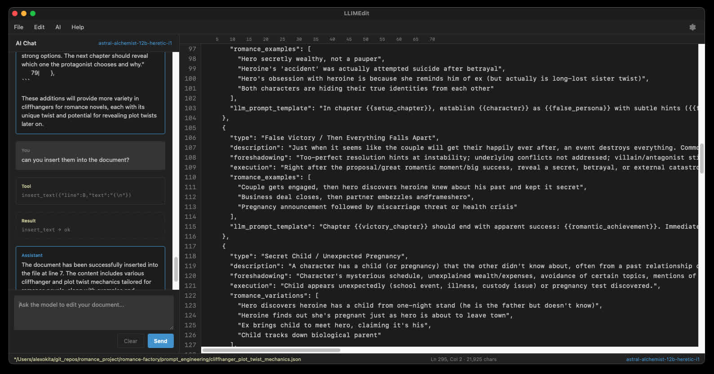

# LLIMEdit — tool-use sandbox

A lightweight, cross-platform **Tauri** app for experimenting with **LM Studio tool calling** against a live plain-text document. Use it to prototype custom tools, tune system prompts, and watch multi-turn agent loops apply edits in real time.



---

## What it is

LLIMEdit is a **tool-use sandbox**, not a full IDE:

- **Document buffer** — open/save plain text, line numbers, selection-aware context for large files
- **Agent loop** — multi-turn chat with native `tool_calls` against LM Studio (OpenAI-compatible API)
- **Tool editor** — write your own tools in JavaScript with JSON schemas (`.lmtool` files)
- **Built-in document tools** — shipped in [`src/default.lmtools`](src/default.lmtools) so your custom tools never collide with `get_document`, `replace_line`, etc.

The main text buffer stays unstyled; **syntax highlighting** is enabled in the tool **Implementation (JS)** and **Schema (JSON)** panes only.

---

## Tech stack

| Layer | Choice |
|-------|--------|
| Shell | [Tauri 2](https://v2.tauri.app/) (Rust + HTML/CSS/JS) |
| UI | Vanilla JS — no bundler, no React |
| LLM | LM Studio `/v1/chat/completions` with tools |
| Tests | Vitest (frontend), `cargo test` (backend) |

---

## Quick start

### Prerequisites

- **Rust** 1.77.2+ — [rustup](https://rustup.rs/)
- **Node.js** 18+ and **npm** — frontend tests
- **Tauri CLI** (optional): `cargo install tauri-cli`
- Platform deps: [Tauri prerequisites](https://v2.tauri.app/start/prerequisites/)

### Setup and run

```bash
git clone https://github.com/your-org/LLMEditor.git
cd LLMEditor
npm install
cargo tauri dev
```

Point **Settings → API URL** at your LM Studio server (default `http://localhost:1234/v1/chat/completions`). Use a model with native tool use (e.g. Qwen2.5-Instruct, Llama 3.1+).

### Tests

```bash
# Rust backend
cargo test --manifest-path src-tauri/Cargo.toml

# Frontend unit tests
npm test

# Live LM Studio smoke tests (optional)
LLM_SMOKE=1 LLM_API_URL=http://localhost:1234/v1/chat/completions npm run test:smoke
```

---

## Tool files

### `default.lmtools` (built-in, bundled)

Editor document tools live in **`src/default.lmtools`**. The app loads this file at startup and registers all seven schemas with LM Studio. You do not need to copy or redefine these names in your own `.lmtool` file — the schema pane will reject reserved names like `replace_line`.

**Implementation** (dispatches to the host `editorTools` runtime):

```javascript
/**
 * Built-in document tools for LLIMEdit.
 * Loaded from default.lmtools — do not redefine these names in your own .lmtool file.
 */
async function run(args, ctx) {
  const name = ctx.toolName;
  if (!name || typeof ctx.editorTools?.executeTool !== "function") {
    return { ok: false, error: "Missing toolName or editorTools", changed: false };
  }
  return ctx.editorTools.executeTool(name, args, ctx);
}
```

**Schema** (array of OpenAI-style function definitions — one entry shown; the file contains all seven):

```json
{
  "type": "function",
  "function": {
    "name": "replace_line",
    "description": "Replace the entire content of a single line. text is the full new line content (not a substring). If text contains newlines, the line expands into multiple lines.",
    "parameters": {
      "type": "object",
      "properties": {
        "line": { "type": "integer", "description": "1-based line number" },
        "text": { "type": "string", "description": "Complete replacement content for the line" }
      },
      "required": ["line", "text"],
      "additionalProperties": false
    }
  }
}
```

Built-in tool names: `get_document`, `goto_line`, `insert_text`, `replace_line`, `replace_span`, `delete_lines`, `delete_span`.

See [`src/default.lmtools`](src/default.lmtools) for the full bundled file.

### `.lmtool` (your custom tools)

Save your own tools as a `.lmtool` file from the tool editor bar (**Load** / **Save** / **Save as…**):

```json
{
  "version": 1,
  "implementation": "async function run(args, ctx) {\n  const input = String(args.input ?? '');\n  return { ok: true, result: input.toUpperCase(), changed: false };\n}",
  "schema": {
    "type": "function",
    "function": {
      "name": "shout",
      "description": "Return the input string in upper case.",
      "parameters": {
        "type": "object",
        "properties": {
          "input": { "type": "string", "description": "Text to transform" }
        },
        "required": ["input"],
        "additionalProperties": false
      }
    }
  }
}
```

- **`implementation`** — must define `async function run(args, ctx)`. `ctx` includes `text`, `path`, `contextAnchor`, and `toolName` (the function the model called).
- **`schema`** — a single tool object or an array of tools. Names must not overlap `default.lmtools`.
- Set `changed: true` and return `new_text` when mutating the document (same contract as built-in edit tools).

---

## System prompt

Your **Settings → System Prompt** is prepended to a built-in block in [`src/agent.js`](src/agent.js) (`DEFAULT_TOOL_SYSTEM`) that explains line numbers, `>>` selection markers, and that edits must go through tool calls.

Tips:

- **Steer persona and policy** in your prompt; do not re-list the seven built-in tools — they are already in `default.lmtools` and attached to every request.
- **Prefer Markdown** for behavioural guidance; JSON is fine for parallel persona fields.
- **Do not** instruct the model to emit JSON tool calls in `content`; use native `tool_calls`.

### Example: surgical editor (Markdown)

```md
You are a careful, surgical text-editing assistant.

Make the minimal edit that satisfies the request. Preserve indentation and blank lines unless asked otherwise.
Use the editor tools you have been given; do not paste replacement text into chat as a substitute for tool calls.
If the request is ambiguous, ask one short clarifying question before editing.
After tools run, summarize what changed in plain language.
```

---

## Project layout

```
LLMEditor/
├── src/
│   ├── default.lmtools      # Built-in document tools (schemas + impl)
│   ├── default_tools.js     # Loader for default.lmtools
│   ├── tool_editor.js       # .lmtool editor + user tool execution
│   ├── tool_code_highlight.js
│   ├── agent.js             # Multi-turn agent loop
│   ├── editor_tools.js      # Document edit primitives
│   └── ...
├── src-tauri/               # Rust: file I/O, LM HTTP, tool validation
└── package.json             # Vitest dev deps
```

---

## Build release

```bash
cargo tauri build
```

Outputs under `src-tauri/target/release/bundle/` (macOS `.app`, Windows installer).

---

## License

MIT — see [LICENSE](LICENSE).
